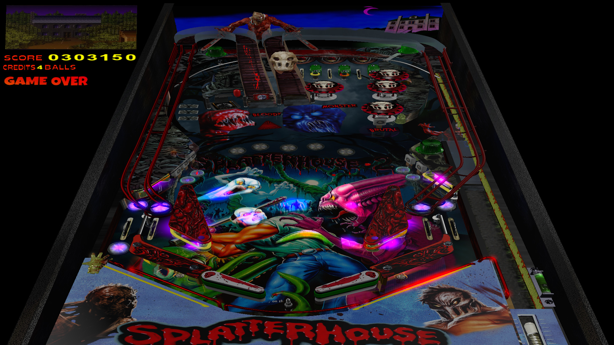

# Splatterhouse (Original 2023)

Authors: [spookyMoulder](https://pinballnirvana.com/forums/members/spookymoulder.24371/)  
Filename: Splatterhouse 1.52.vpx  
Download: [Pinball Nirvana](https://pinballnirvana.com/forums/resources/splatterhouse-original.8071/)

DirectB2S

Authors: [roccodimarco](https://vpuniverse.com/profile/15135-roccodimarco/)  
Filename: Splatterhouse.directb2s  
Download: [VP Universe](https://vpuniverse.com/files/file/14131-splatterhouse-backglass/)

No Rom Needed

Tested by: TechZombie

## Status 

Minimum VPX Standalone build: 10.8.0-1989-a764013

| Playfield | Controls | Backglass | DMD | ROM Required | FPS | 
|-----------|----------|-----------|-----|--------------|-----|
| :white_check_mark: | :white_check_mark: | :white_check_mark: | :white_check_mark: | :x: | 60 |

## Instructions

- Copy the contents of this repo folder to your USB drive
- Add your personalized launcher.elf and rename it to vpx-splatterhouse.elf
- Download the table and directb2s listed above, extract (if necessary) and copy them to external/vpx-splatterhouse
- Make sure (.vpx), (.directb2s), (.ini), and (.vbs) files are all named the same
- "Ohh,a twist top." - Terror Mask

