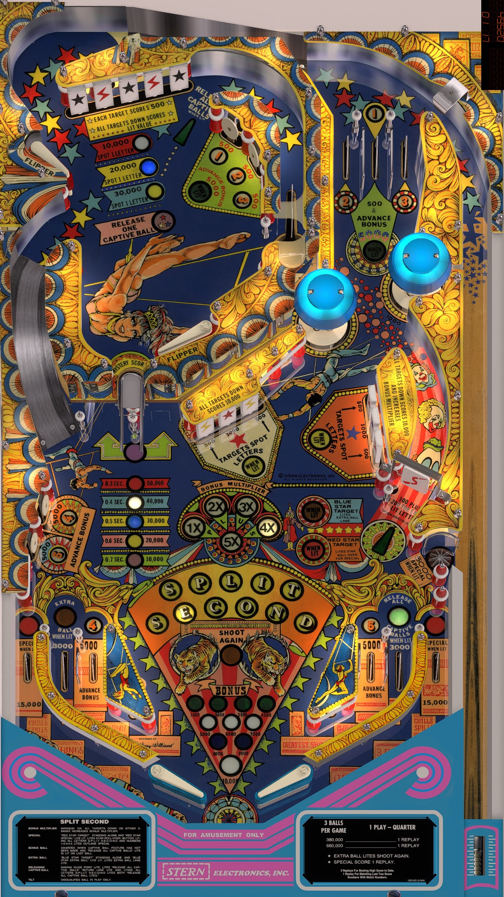

# Split Second (Stern 1981)

Authors: [jpsalas](https://www.vpforums.org/index.php?showuser=277)  
Version: 4.0.1  
Download: [VPForums](https://www.vpforums.org/index.php?app=downloads&showfile=15957)

DirectB2S

Authors: [Wildman](https://vpuniverse.com/profile/5-wildman/)  
Download: [VPUniverse](https://vpuniverse.com/files/file/3051-split-second-stern-1981/)

ROM

ROM Name: splitsec.zip  
Download: [VPForums](https://www.vpforums.org/index.php?app=downloads&showfile=751)  

SHA1: E57CE9378A50675BE2347A54CE0534F80F852991  
MD5:  8B096F585C2A1730D46735D694887ED9

Tested by: evilwraith

## Status 

Minimum VPX Standalone build: 10.8.0-1989-a764013

| Playfield | Controls | Backglass | DMD | ROM Required | FPS | 
|-----------|----------|-----------|-----|--------------|-----|
| :white_check_mark: | :white_check_mark: | :white_check_mark: | :x: | :white_check_mark: | 60 |

## Instructions

