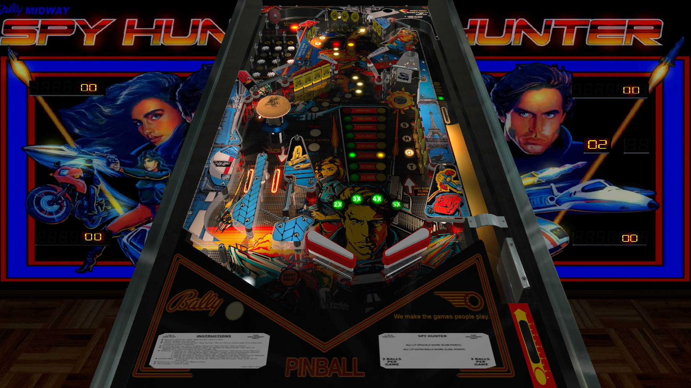

# Spy Hunter (Bally 1984)
Tested by: kaoticBPR

Authors: [32asssassin](https://www.vpforums.org/index.php?showuser=77712)  
Version: 1.4  
Download: [vpforums](https://www.vpforums.org/index.php?app=downloads&showfile=11624)

DirectB2S

Authors: [wildman](https://vpuniverse.com/profile/5-wildman/)  
Version: 1.0.0  
Download: [VP Universe](https://vpuniverse.com/files/file/5918-spy-hunter-bally-1984/)

ROM

Download: [vpforums](https://www.vpforums.org/index.php?app=downloads&showfile=131)  
Rom Name: spyhuntr.zip

## Status 

Minimum VPX Standalone build: 10.8.0-1989-a764013

| Playfield | Controls | Backglass | DMD | ROM Required | FPS | 
|-----------|----------|-----------|-----|--------------|-----|
| :white_check_mark: | :white_check_mark: | :white_check_mark: | :x: | :white_check_mark: | 42 |

## Instructions

- Install this table through the Table Manager, using the `Add Table` > `Manual` page
- If you need help, more infomation found on the wiki: [TM - Add Table - Manual](https://github.com/LegendsUnchained/vpx-standalone-alp4k/wiki/%5B04%5D-%F0%9F%A7%A1-TM-%E2%80%90-Other-Features#add-table---manual)
- If the table requires any additional files/steps, click `GO TO TABLE` after adding, and the TM will open to the relevant table folder.
- "The challenge is thrilling ... the stakes are high ... the pace is deadly!"

