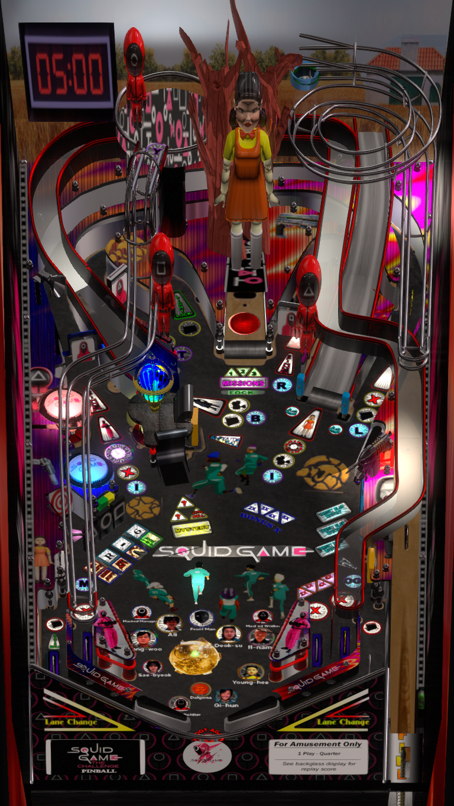

# Squid Game (Original 2024)

Authors: [Rickmeine](https://vpuniverse.com/profile/46002-rickmeine/)  
Download File Name: Squid Game1.2.zip  
Filename: Squid Game1.2.vpx  
Download: [VP Forums](https://vpuniverse.com/files/file/23135-squid-game)

DirectB2S included with Zip file. 

No ROM Needed

Tested by: TechZombie

## Status 

Minimum VPX Standalone build: 10.8.0-1989-a764013

| Playfield | Controls | Backglass | DMD | ROM Required | FPS | 
|-----------|----------|-----------|-----|--------------|-----|
| :white_check_mark: | :white_check_mark: | :white_check_mark: | :white_check_mark: | :x: | 48 |

## Instructions

- Make sure to use the Table Manager to install this table.
- Instructions can be found on the wiki [Add Table - Manual](https://github.com/LegendsUnchained/vpx-standalone-alp4k/wiki/%5B04%5D-%F0%9F%A7%A1-TM-%E2%80%90-Other-Features#add-table---manual)
- If the table requires any additional files/steps, click `GO TO TABLE` after adding, and the TM will open to the relevant table folder.
- "You Don't Trust People Here Because You Can. You Do It Because You Don't Have Anybody Else." - Gi-hun

