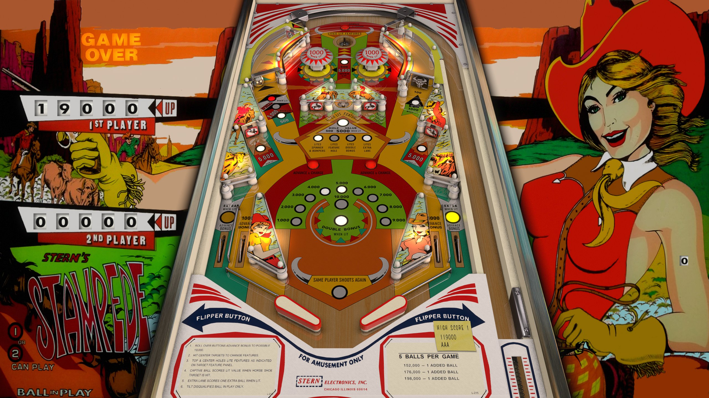

# Stampede (Stern 1977)

Author: [jpsalas](https://www.vpforums.org/index.php?showuser=277)  
Version: 5.5.0  
Stampede (Stern 1977) v55_VPX8.vpx  
Download: [VPUniverse](https://www.vpforums.org/index.php?app=downloads&showfile=17797#)

DirectB2S
Author: [halen](https://www.vpforums.org/index.php?showuser=74)  
Backglass Included with Table above  
Stampede (Stern 1977) JP_VPX8.directb2s

No ROM Needed for Table
  
Tested by:  
[psybocilin]

## Status 

Minimum VPX Standalone build: 10.8.0-1989-a764013

| Playfield | Controls | Backglass | DMD | ROM Required | FPS | 
|-----------|----------|-----------|-----|--------------|-----|
| :white_check_mark: | :white_check_mark: | :white_check_mark: | :x: | :x: | 60 |

## Instructions

- Copy the contents of this repo folder to your USB drive
- Add your personalized launcher.elf and rename it to vpx-stampede.elf
- Download the table and directb2s zips above, extract (if necessary) and copy into /external/vpx-stampede
- Make sure (.vpx), (.directb2s), and (.ini) files are all named the same
- "Keep your eyes where I can see 'um and stop staring at my backglass!"
