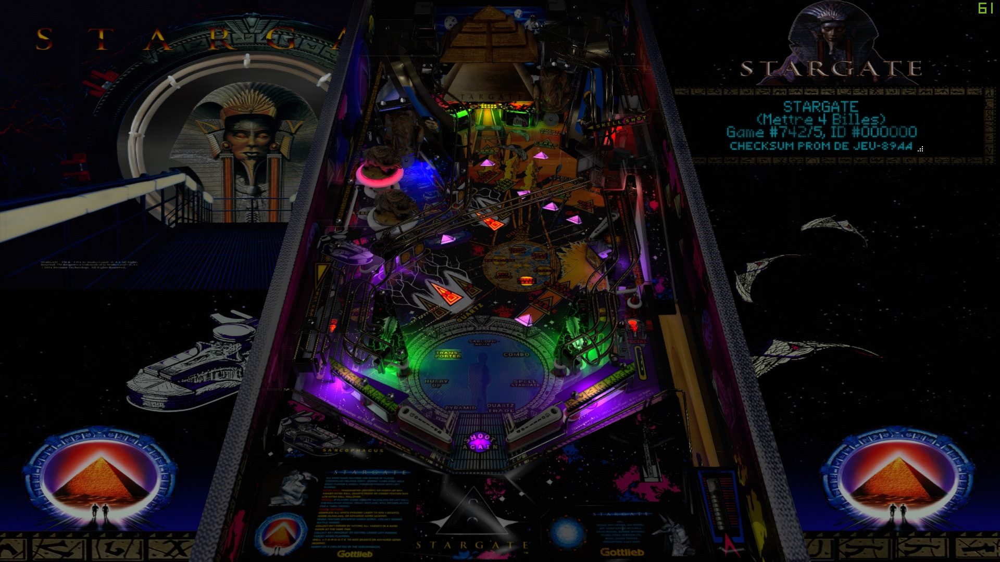

# Stargate (Gottlieb 1995)

Tested by: Mox

## Information 
| File Type | Link | Version | Author(s) | 
|:---------:|:----:|:-------:|:---------:|
| VPX | [VP Forums](https://www.vpforums.org/index.php?app=downloads&showfile=14952) | 1.3.0 | [JLouLoulou](https://www.vpforums.org/index.php?showuser=134330) |
| DirectB2S | [VP Universe](https://vpuniverse.com/files/file/11644-stargate-gottlieb-1995-fulldmd/) | 1.0.0 | [Walterwhite](https://vpuniverse.com/profile/17464-walterwhite/) |
| ROM | [Pinball Nirvana](https://pinballnirvana.com/forums/resources/stargat5.6026/) | stargat5 | [NateMac00](https://pinballnirvana.com/forums/members/natemac00.30769/) |

## Status 
Minimum VPX Standalone build: 10.8.0-2006-6d603fb
| Playfield | Controls | Backglass | DMD | ROM Required | FPS | 
|:---------:|:--------:|:---------:|:---:|:------------:|:---:|
| :white_check_mark: | :white_check_mark: | :white_check_mark: | :white_check_mark: | :white_check_mark: | 40 |

## Instructions

- Make sure to use the Table Manager to install this table.
- Instructions can be found on the wiki [Add Table - Manual](https://github.com/LegendsUnchained/vpx-standalone-alp4k/wiki/%5B04%5D-%F0%9F%A7%A1-TM-%E2%80%90-Other-Features#add-table---manual)
- If the table requires any additional files/steps, click `GO TO TABLE` after adding, and the TM will open to the relevant table folder.
- "It will take you a million light years from home. But will it bring you back?"

