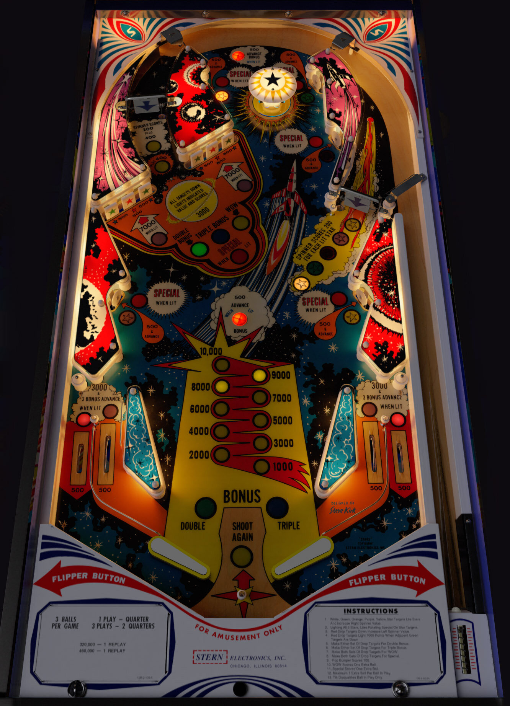

# Stars (Stern 1978)

Authors: [bord](https://vpuniverse.com/profile/9265-bord/)\
Version: 1.0.2\
Download: [VPUniverse](https://vpuniverse.com/files/file/8518-stars-stern-1978-sk-1/)

#### DirectB2S

Authors: [Wildman](https://vpuniverse.com/profile/5-wildman/)\
Version: 2.0\
Download: [VPUniverse](https://vpuniverse.com/files/file/2201-starsstern1978/)

#### ROM

Download: [VPForums](https://www.vpforums.org/index.php?app=downloads&showfile=729)\
ROM Name and version: `stars`

Tested by: [GyroJoe](https://github.com/GyroJoe)

## Status 

Minimum VPX Standalone build: 10.8.0-2042-1431983

| Playfield | Controls | Backglass | DMD | ROM Required | FPS | 
|-----------|----------|-----------|-----|--------------|-----|
| :white_check_mark: | :white_check_mark: | :white_check_mark: | :white_check_mark: | :white_check_mark: | 48 |

## Instructions

- Install this table through the Table Manager, using the `Add Table` > `Manual` page
- If you need help, more infomation found on the wiki: [TM - Add Table - Manual](https://github.com/LegendsUnchained/vpx-standalone-alp4k/wiki/%5B04%5D-%F0%9F%A7%A1-TM-%E2%80%90-Other-Features#add-table---manual)
- If the table requires any additional files/steps, click `GO TO TABLE` after adding, and the TM will open to the relevant table folder.
- "Space age profits"

