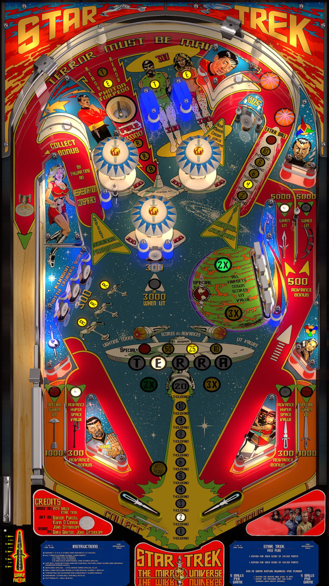

# Star Trek the Mirror Universe (Zitt 2014)

Author: [JPsalas](https://www.vpforums.org/index.php?showuser=277)

Tested by: Bla1ze

Version: 1.0.0

Download: [VP Forums](https://www.vpforums.org/index.php?app=downloads&showfile=18568)

DirectB2S

Author: [Hauntfreaks](https://vpuniverse.com/profile/5216-hauntfreaks/)

Version: 1.0.0

Download: [VP Universe](https://vpuniverse.com/files/file/21439-star-trek-mirror-universe-bally-1978-b2s/)

ROMS (Both Are Needed)

Download 1: [Pinball Nirvana](https://pinballnirvana.com/forums/resources/startrek.2390/)

Download 2: [Internet Archive](https://archive.org/download/vpinmame/roms/roms.zip/startreb.zip)

## Status 

Minimum VPX Standalone build: 10.8.0-1989-a764013
| Playfield | Controls | Backglass | DMD | ROM Required | FPS | 
|-----------|----------|-----------|-----|--------------|-----|
| :white_check_mark: | :white_check_mark: | :white_check_mark: | :white_check_mark: | :white_check_mark: | 60 |

## Instructions

- Install this table through the Table Manager, using the `Add Table` > `Manual` page
- If you need help, more information found on the wiki: [TM - Add Table - Manual](https://github.com/LegendsUnchained/vpx-standalone-alp4k/wiki/%5B04%5D-%F0%9F%A7%A1-TM-%E2%80%90-Other-Features#add-table---manual)
- If the table requires any additional files/steps, click `GO TO TABLE` after adding, and the TM will open to the relevant table folder.
- Live a short life and languish. 🖖

