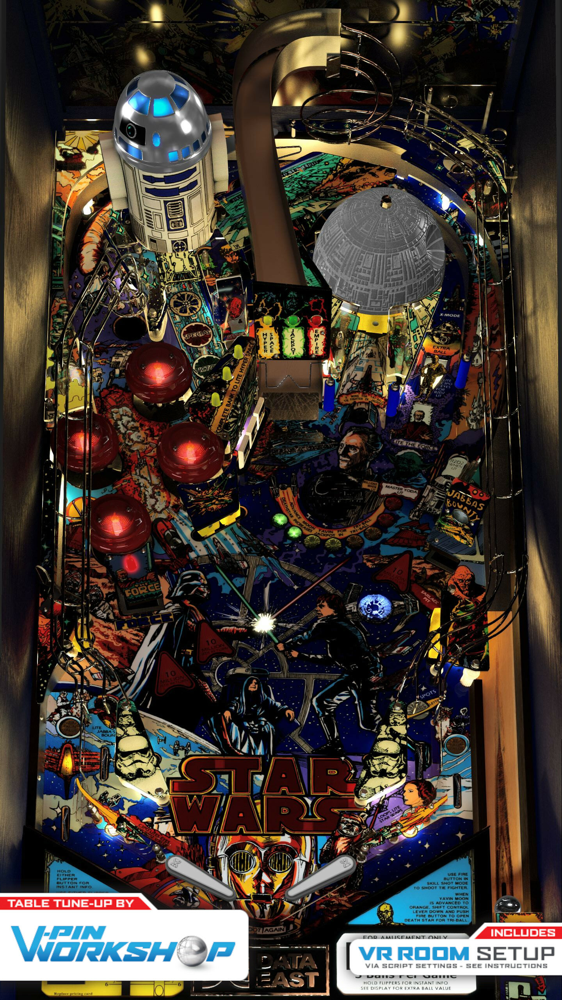

# Star Wars (Data East 1992)

---

## Files
| File Type | Link | Version | Author | 
|-----------|--------|----------|--------------|
| **VPX** | [VP Forums](https://www.vpforums.org/index.php?app=downloads&showfile=18153) | 2.0 | [Bigus1](https://www.vpforums.org/index.php?showuser=107629) |
| **B2S** | [VP Universe](https://vpuniverse.com/files/file/12651-star-wars-data-east-1992-b2s-with-full-dmd/) | 1.5 | [hauntfreaks](https://vpuniverse.com/profile/5216-hauntfreaks/) |
| **ROM** | [VP Universe](https://vpuniverse.com/files/file/4201-star-wars-106-20th-anniversary/) | 1.06 | [CarnyPriest](https://vpuniverse.com/profile/1146-carnypriest/) |

### Note!

For the B2S download the first file: `Star Wars (Data East 1992) full dmd.zip`

If you would like to use version 1.07 of the ROM, instead of the above 1.06, then:

- Download the 2 ROM files here:
   - ROM 1: [VP Universe](https://vpuniverse.com/files/file/4362-star-wars-107-20th-anniversary/)  
   - ROM 2: [VP Forums](https://www.vpforums.org/index.php?app=downloads&showfile=7207)
- Upload both rom files, STILL ZIPPED, to `vpx-starwars/pinmame/roms`
- Open `Star Wars (Data East 1992)_Bigus(MOD)2.0.vbs` file, and change line 40 from `Const cGameName = "stwr_106"` to `Const cGameName = "stwr_107"`

---

**Tested by:** [mcap] & [mrandromeda]

## Status 

Minimum VPX Standalone build: 10.8.0-1989-a764013

| Playfield | Controls | Backglass | DMD | ROM Required | FPS | 
|-----------|----------|-----------|-----|--------------|-----|
| :white_check_mark: | :white_check_mark: | :white_check_mark: | :white_check_mark: | :white_check_mark: | 60 |

## Instructions

- Copy the contents of this repo folder to your USB drive
- Add your personalized launcher.elf and rename it to vpx-starwars.elf
- Download the table and directb2s versions listed above, extract and copy them into this folder. 
- Make sure (.vpx), (.directb2s), (.ini) and (.vbs) files are all named the same
- Place the ROM zip file into vpx-starwars/pinmame/roms folder. DO NOT UNZIP!
