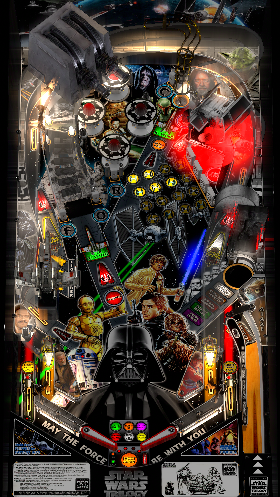

# Star Wars Trilogy (Sega 1997)

Authors: [siggi](https://vpuniverse.com/profile/8779-siggi/)  
Version: 1.1  
Download: [VPUniverse](https://vpuniverse.com/files/file/11447-star-wars-trilogy-siggis-mod/)

DirectB2S

Authors: [HauntFreaks](https://vpuniverse.com/profile/5216-hauntfreaks/)  
Version: v2.0  
Download: [VPUniverse](https://vpuniverse.com/files/file/12429-star-wars-trilogy-sega-1997-b2s-with-full-dmd/)  
*Download the hi-res version

ROM

Download: [vpforums](http://www.vpforums.org/index.php?app=downloads&showfile=1073)  
ROM Name and version: swtril43

## Status 

Minimum VPX Standalone build: 10.8.0-1989-a764013

| Playfield | Controls | Backglass | DMD | ROM Required | FPS | 
|-----------|----------|-----------|-----|--------------|-----|
| :white_check_mark: | :white_check_mark: | :white_check_mark: | :white_check_mark: | :white_check_mark: | 48 |

## Instructions

- Copy the contents of this repo folder to your USB drive
- Add your personalized launcher.elf and rename it to vpx-starwarstrilogy.elf
- Download the table and directb2s versions listed above, extract and copy them into this folder
- Make sure (.vpx), and (.directb2s) files are all named the same
- Place swtril43.zip ROM in the external/vpx-starwarstrilogy/pinmame/roms folder. *Do Not unzip*!
- "May the force be with you!"
