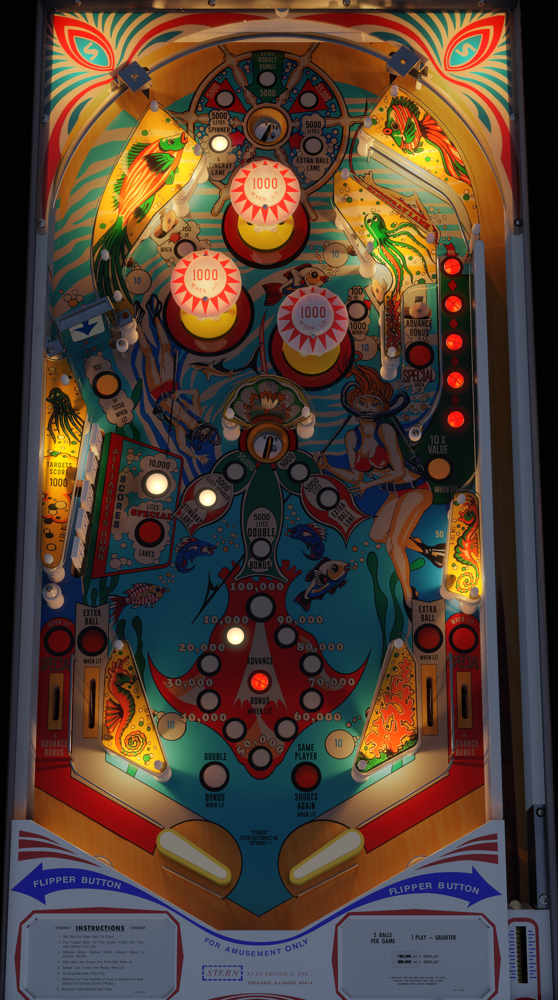

# Stingray (Stern 1977)

Authors: [bord](https://vpuniverse.com/profile/9265-bord/)  
Version: 2.0.0  
Download: [VPUniverse](https://vpuniverse.com/files/file/14533-stingray-stern-1977/)

DirectB2S

Authors: [hauntfreaks](https://vpuniverse.com/profile/5216-hauntfreaks/)  
Download: [VPUniverse](https://vpuniverse.com/files/file/14531-stingray-stern-1977-b2s/)

ROM

ROM Name: stingray.zip  
Download: [VPForums](https://www.vpforums.org/index.php?app=downloads&showfile=728)  

SHA1: 6D4AF266ED079FD54B5D15844280648CD136A003  
MD5:  15EF93252FB195441AD597DB0F0DA0E3 

Tested by: evilwraith

## Status 

Minimum VPX Standalone build: 10.8.0-1989-a764013

| Playfield | Controls | Backglass | DMD | ROM Required | FPS | 
|-----------|----------|-----------|-----|--------------|-----|
| :white_check_mark: | :white_check_mark: | :white_check_mark: | :x: | :white_check_mark: | 47 |

## Instructions

