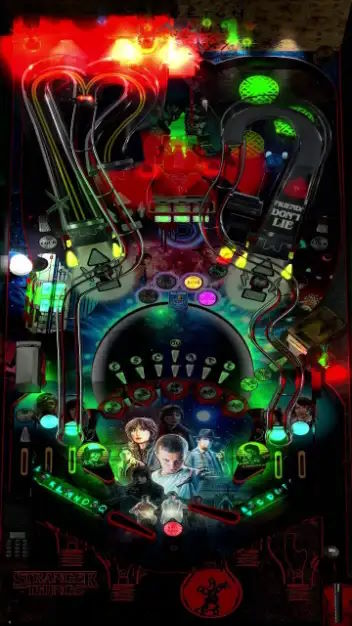

# Stranger Things – Stranger Edition (Original 2018)

---

## Files
| File Type | Link | Version | Author | 
|-----------|--------|----------|--------------|
| **VPX** | [orbitalpin](https://orbitalpin.com/downloads/) | 0.52 | [ScottyWic](https://orbitalpin.com/) |
| **B2S** | N/A | N/A | N/A |
| **DMD** | N/A | N/A | N/A |
| **ROM** | N/A | N/A | N/A |

**Tested by:** [mrandromeda]

---

## Status 
**Minimum VPX Standalone build:** 10.8.0-5b941e6
| Playfield | Controls | Backglass | DMD | ROM Required | FPS | 
|-----------|----------|-----------|-----|--------------|-----|
| :white_check_mark: | :white_check_mark: | :white_check_mark: | :white_check_mark: | :x: | 45 |

---

 
<table>
  <tr>
    <td style="background-color: #FFDDDD; padding: 0; border-left: 4px solid #FF0000;">
      

        <strong>⚠️ WARNING ⚠️</strong>
      

      

        Manually added puppacks are not supported by the VPXS 4KP team We will not be able to help you diagnose issues until this puppack is in the Wizard
      

    </td>
  </tr>
</table>
 

---

## Instructions
- Copy the contents of this repo folder to your USB drive
- Add your personalized launcher.elf and rename it to `vpx-strangerthings.elf`
- Go to the website listed above and scroll down for Stranger Things – Stranger Edition. **Remember (copy) the password in the sixth column** and click on the VPX and Mega link in the previous column and download both archives.
- Extract from the archive `Stranger Things - SE 1.47_OSB.rar` the table and copy it into `vpx-strangerthings`
- Make sure `(.vpx)` `(.vbs)` and `(.ini)` are all named the same.
- Create the folder `pupvideos`.
- Extract the archive `STLEpup.rar` and place the `STLE147\STLE` subfolder in `pupvideos` so you have `pupvideos\STLE`.
- "You're all so nerdy, it makes me physically ill." — Erica Sinclair.
