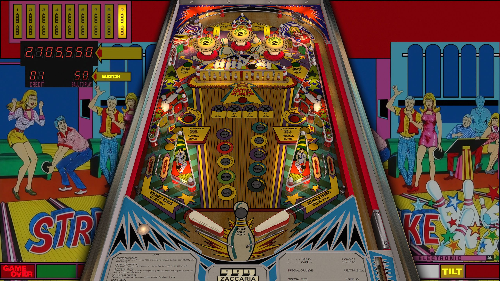

# Strike (Zaccaria 1978)

---

## Files
| File Type | Link | Version | Author | 
|-----------|--------|----------|--------------|
| **VPX** | [vpforums](https://www.vpforums.org/index.php?s=98e1beeb51039d706abb11cc2fd77bf1&app=downloads&showfile=18845) | 1.0 | [jpsalas](https://www.vpforums.org/index.php?showuser=277) |
| **B2S** | [vpforums](https://www.vpforums.org/index.php?s=98e1beeb51039d706abb11cc2fd77bf1&app=downloads&showfile=18845) | 1.0 | [jpsalas](https://www.vpforums.org/index.php?showuser=277) |
| **ROM** | [vpforums](https://www.vpforums.org/index.php?app=downloads&showfile=460) | 1.0 | [destruk](https://www.vpforums.org/index.php?showuser=5) |

**Tested by:** [Ominous Osie]

---

## Status 
**Minimum VPX Standalone build:** 10.8.0-1431983
| Playfield | Controls | Backglass | DMD | ROM Required | FPS | 
|-----------|----------|-----------|-----|--------------|-----|
| :white_check_mark: | :white_check_mark: | :white_check_mark: | :x: | :white_check_mark: | 60 |

---

## Instructions

- Make sure to use the Table Manager to install this table.
- Instructions can be found on the wiki [Add Table - Manual](https://github.com/LegendsUnchained/vpx-standalone-alp4k/wiki/%5B04%5D-%F0%9F%A7%A1-TM-%E2%80%90-Other-Features#add-table---manual)
- If the table requires any additional files/steps, click `GO TO TABLE` after adding, and the TM will open to the relevant table folder.

