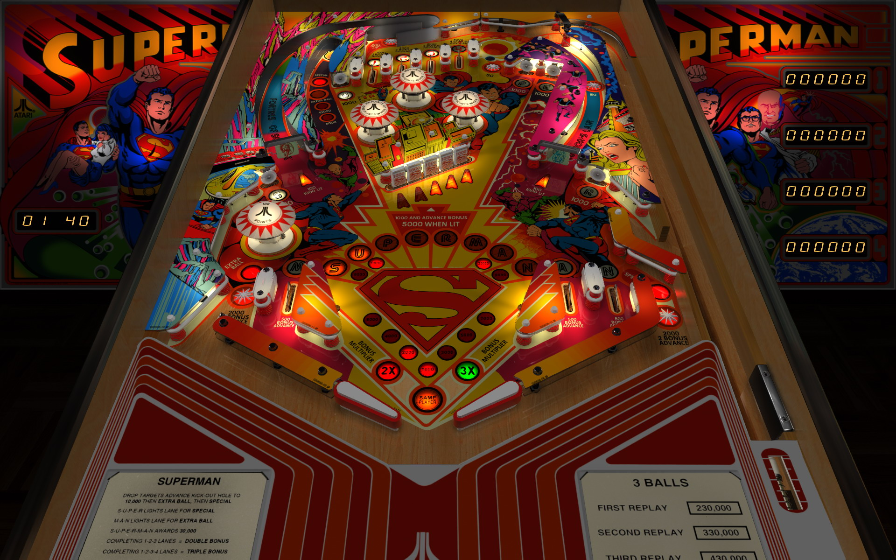

# Superman (Atari 1979)

Author(s): [bigus1](https://www.vpforums.org/index.php?showuser=107629)
  
Version:  Superman (Atari 1979)_Bigus(MOD) 1.2

Download:  [VP Forums](https://www.vpforums.org/index.php?app=downloads&showfile=18560)

DirectB2S

Authors: [hauntfreaks](https://vpuniverse.com/profile/5216-hauntfreaks/)

Version: Superman (Atari 1979) b2s

Download: [VP Universe](https://vpuniverse.com/files/file/7422-superman-atari-1979-b2s/)

ROM: Superman

Authors: [destruk](https://www.vpforums.org/index.php?showuser=5)

Version: superman.zip

Download: [VP Forums](https://www.vpforums.org/index.php?app=downloads&showfile=181)

Tested by:
[CoffeeAtJoes]

## Status 

Minimum VPX Standalone build: 10.8.0-1983-b84441e
| Playfield | Controls | Backglass | DMD | ROM Required | FPS | 
|-----------|----------|-----------|-----|--------------|-----|
| :white_check_mark: | :white_check_mark: | :white_check_mark: | :white_check_mark: | :white_check_mark: | 50 |

## Instructions

- OPTIONAL MUSIC INSTRUCTIONS: Download Goldchicco's 1.2a table package [here] (https://vpuniverse.com/files/file/7372-superman-atari-1979/)
- Place ONLY the folder 'Superman' into provided folder /vpx-superman/Music
- Right Magnasave - Stop Track, Left Magnasave - Resume/Next Track
- "It's bird!" "It's a plane!" "IT'S SUPERMAN... on your Legends 4K!"
