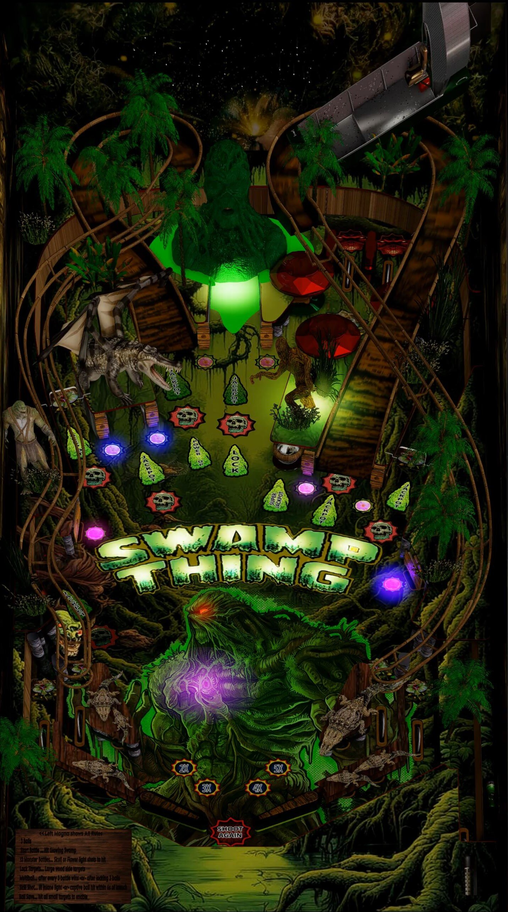

# Swamp Thing 2.0 Bayou Edition (LTek 2024)

Authors: [LTek, Clairvius](https://vpuniverse.com/profile/67685-ltek/)  

Tested by: Bla1ze

Version: 2.1.1  

Download: [VP Universe](https://vpuniverse.com/files/file/21040-swamp-thing-20-bayou-edition-ltek-2024/)

DirectB2S

Included in table download

## Status 

Minimum VPX Standalone build: 10.8.0-1983-a764013
| Playfield | Controls | Backglass | DMD | ROM Required | FPS | 
|-----------|----------|-----------|-----|--------------|-----|
| :white_check_mark: | :white_check_mark: | :white_check_mark: | :white_check_mark: | :x: | 45 |

## Instructions

- Copy the contents of this repo folder to your USB drive
- Add your personalized launcher.elf and rename it to vpx-swampthingbayou.elf
- Download the table and directb2s versions listed above and copy them into this folder
- Much beauty in the swamp, if you only look 

