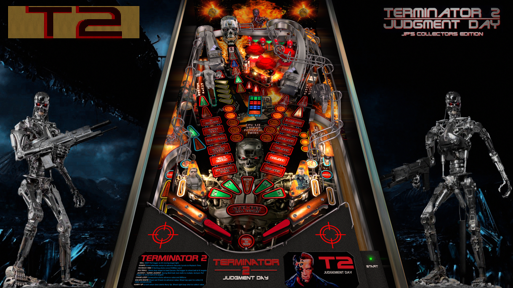

# JP's Terminator 2 (Original 2020)

---

## Files
| File Type | Link | Version | Author | 
|-----------|--------|----------|--------------|
| **VPX** | [VP Forums](https://www.vpforums.org/index.php?app=downloads&showfile=15249) | 5.5.0 | [jpsalas](https://www.vpforums.org/index.php?showuser=277) |
| **B2S** | [VP Universe](https://vpuniverse.com/files/file/13345-terminator-2-williams-1991-alt-b2s-with-full-dmd/) | 1.1 | [hauntfreaks](https://vpuniverse.com/profile/5216-hauntfreaks/) |
| **DMD** | N/A | N/A | N/A |
| **ROM** | [VP Forums](https://www.vpforums.org/index.php?app=downloads&showfile=7318) | N/A | N/A |
| **PUP** | [VP Universe](https://vpuniverse.com/files/file/22604-terminator-2-pup-pack-and-full-dmd/) | 2.0.0 | [PIPAllah](https://vpuniverse.com/profile/60727-pipallah/) |

**Tested by:** [mrandromeda]

---

## Status 
**Minimum VPX Standalone build:** 10.8.0-5b941e6
| Playfield | Controls | Backglass | DMD | ROM Required | FPS | 
|-----------|----------|-----------|-----|--------------|-----|
| :white_check_mark: | :white_check_mark: | :white_check_mark: | :white_check_mark: | :white_check_mark: | 60 |

---

## Instructions

- Copy the contents of this repo folder to your USB drive
- Add your personalized launcher.elf and rename it to `vpx-t2jp.elf`
- Download the table and directb2s versions listed above, extract (if necessary) and copy them into `vpx-t2jp`
- Rom file `t2_l8.zip` stays in zip folder, place zip file in `vpx-t2jp/pinmame/roms`
- Make sure `(.vpx)` `(.direct2b2s)` `(.vbs)` and `(.ini)` are all named the same.

## Optional

The puppack is optional, install if you like videos on your backglass.

- Download the `t2_l8.zip` puppack from the link listed above.
- Create the folder `pupvideos` and extract the `t2_l8.zip` in this folder. Filename is the same as the rom filename, so check that you extract the correct file and not the rom.
- Unzip the `use_these_pup_files.zip` and place them inside the `pupvideos/t2_l8` folder, and overwrite files if prompted.
- __Delete the directb2s file because this is not needed anymore and makes the backglass blink.__

