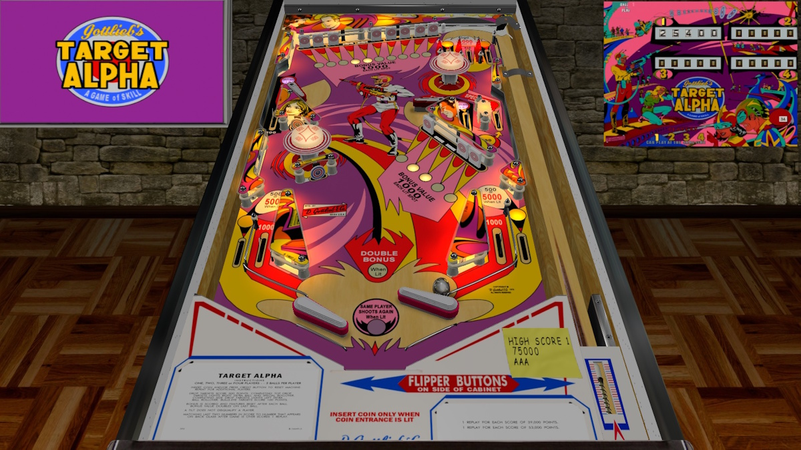

# Target Alpha (Gottlieb 1976)

Authors: [teisen](https://www.vpforums.org/index.php?showuser=140346)  
Version: 1.0  
Download: [VPForums](https://www.vpforums.org/index.php?app=downloads&showfile=17957)

DirectB2S

Authors: [hauntfreaks](https://vpuniverse.com/profile/5216-hauntfreaks/)  
Download: [VPUniverse](https://vpuniverse.com/files/file/15097-target-alpha-gottlieb-1976-b2s/)

ROM

None

**Tested by:** [Curt](https://github.com/Old-Cyrus)

## Status 

Minimum VPX Standalone build: 10.8.0-1989-a764013

| Playfield | Controls | Backglass | DMD | ROM Required | FPS | 
|-----------|----------|-----------|-----|--------------|-----|
| :white_check_mark: | :white_check_mark: | :white_check_mark: | :x: | :x: | 49 |

## Instructions

- Copy the contents of this repo folder to your USB drive
- Add your personalized launcher.elf and rename it to vpx-targetalpha.elf
- Download the table and directb2s listed above, extract (if necessary) and copy to external/vpx-targetalpha
- Make sure (.vpx), (.directb2s), and (.ini) files are all named the same
