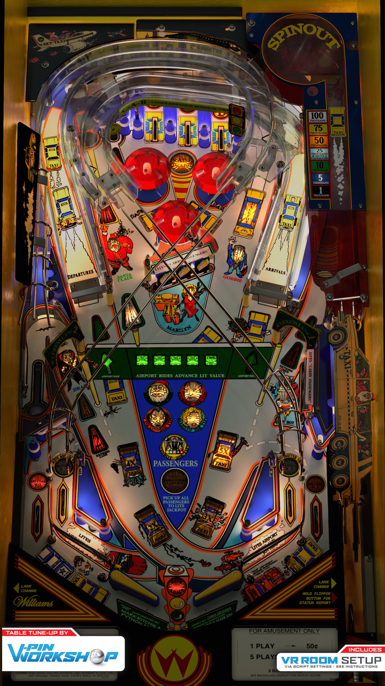

# Taxi (Williams 1988)

Authors: [bigus1](https://www.vpforums.org/index.php?showuser=107629)  
Version: 1.0
Download: [VP Forum](https://www.vpforums.org/index.php?app=downloads&showfile=18659)

DirectB2S

Authors: [hauntfreaks](https://vpuniverse.com/profile/5216-hauntfreaks/)  
Version: 1.0.0
Download: [VP Universe](https://vpuniverse.com/files/file/21760-taxi-williams-1988-b2s-authentic/)

ROM

Download: [VP Forums](https://www.vpforums.org/index.php?app=downloads&showfile=914)

## Status 

Minimum VPX Standalone build: 10.8.0-1989-a764013

| Playfield | Controls | Backglass | DMD | ROM Required | FPS | 
|-----------|----------|-----------|-----|--------------|-----|
| :white_check_mark: | :white_check_mark: | :white_check_mark: | :white_check_mark: | :white_check_mark: | 34 |

## Instructions

- Copy the contents of this repo folder to your USB drive
- Add your personalized launcher.elf and rename it to vpx-taxi.elf
- Download the table and directb2s versions listed above, extract and copy them into this folder
- Make sure (.vpx), (.directb2s), (.ini) and (.vbs) files are all named the same

