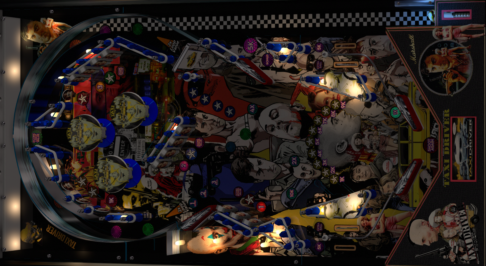

# Taxi Driver (Original 2024)

Authors: [icepinball](https://vpuniverse.com/profile/4306-icepinball/)  
Download File Name: Taxi Driver 2024 & Taxi Driver VR 2024.zip  
Filename: Taxi Driver Alternative (Iceman 2024)  
Download: [VP Forums](https://vpuniverse.com/files/file/20593-reskin-taxi-driver-100-reskin-taxi-driver-vr-version-2024/)

DirectB2S included with Table.rar file. 

ROM

Authors: [destruk](https://www.vpforums.org/index.php?showuser=5)  
Filename: seawitch.zip  
Download: [VP Forums](https://www.vpforums.org/index.php?app=downloads&showfile=742)

Tested by: TechZombie

## Status 

Minimum VPX Standalone build: 10.8.0-1989-a764013

| Playfield | Controls | Backglass | DMD | ROM Required | FPS | 
|-----------|----------|-----------|-----|--------------|-----|
| :white_check_mark: | :white_check_mark: | :white_check_mark: | :x: | :white_check_mark: | 60 |

## Instructions

- Make sure to use the Table Manager to install this table.
- Instructions can be found on the wiki [Add Table - Manual](https://github.com/LegendsUnchained/vpx-standalone-alp4k/wiki/%5B04%5D-%F0%9F%A7%A1-TM-%E2%80%90-Other-Features#add-table---manual)
- If the table requires any additional files/steps, click `GO TO TABLE` after adding, and the TM will open to the relevant table folder.
- Select/Copy Music Folder and move to external/vpx-taxidriver
- "You talkin' to me?" - Travis Bickle

