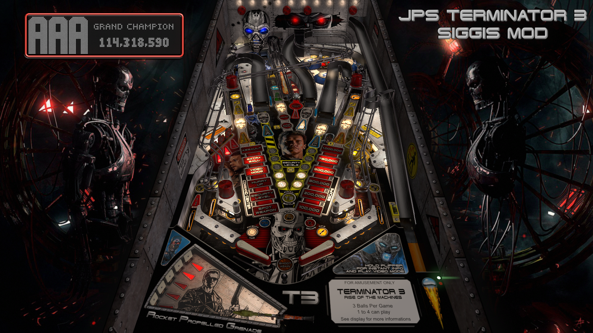

# Terminator 3 (Stern 2003)

Authors: [Siggi](https://vpuniverse.com/profile/8779-siggi/)  
Version: 2.0_TW  
Download: [VP Universe](https://vpuniverse.com/files/file/15094-terminator-3-stern-2003-siggis-mod-jp/)  
Note: Choose Terminator 3 (Stern 2003 - Siggi)TW.zip

DirectB2S

Authors: [ryguy417](https://vpuniverse.com/profile/31096-ryguy417/)  
Version: 2.0  
Download: [VP Universe](https://vpuniverse.com/files/file/12992-terminator-3-stern-2003-b2s-with-full-dmd/)

ROM

Download: [VP Universe](https://vpuniverse.com/files/file/869-term3zip/)

## Status 

Minimum VPX Standalone build: 10.8.0-1989-a764013

| Playfield | Controls | Backglass | DMD | ROM Required | FPS | 
|-----------|----------|-----------|-----|--------------|-----|
| :white_check_mark: | :white_check_mark: | :white_check_mark: | :white_check_mark: | :white_check_mark: | 50 |

## Instructions

- Make sure to use the Table Manager to install this table.
- Instructions can be found on the wiki [Add Table - Manual](https://github.com/LegendsUnchained/vpx-standalone-alp4k/wiki/%5B04%5D-%F0%9F%A7%A1-TM-%E2%80%90-Other-Features#add-table---manual)
- If the table requires any additional files/steps, click `GO TO TABLE` after adding, and the TM will open to the relevant table folder.

