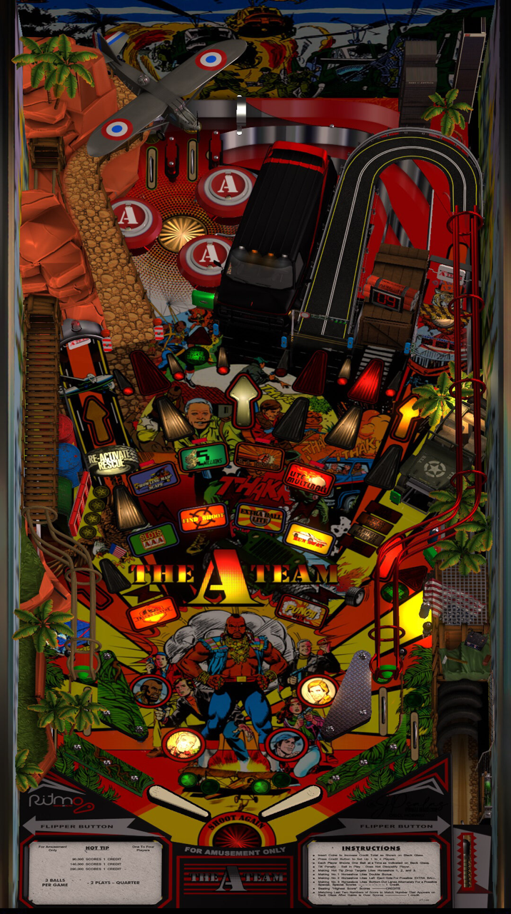

# The A-Team

Author: [jicho2003](https://vpuniverse.com/profile/15718-jicho2003/) 

Tested by: Bla1ze

Version: 3.0.1
 
Download: [VP Universe](https://vpuniverse.com/files/file/17525-the-a-team-original-pinball/)

DirectB2S

Included in table download

## Note

This table *may* initially crash, requiring a restart of your machine. Just try again.

## Status 

Minimum VPX Standalone build: 10.8.0-1983-a764013
| Playfield | Controls | Backglass | DMD | FPS | 
|-----------|----------|-----------|-----|----------|
| :white_check_mark: | :white_check_mark: | :white_check_mark: | :white_check_mark: | 55 |

## Instructions

- Copy the contents of this repo folder to your USB drive
- Add your personalized launcher.elf and rename it to vpx-theateam.elf
- Download the table and directb2s versions listed above and copy them into this folder
- Make sure (.vpx), (.directb2s), (.ini) and (.vbs) files are all named the same
- Be sure to move the TheATeam folder to your vpx-theateam folder as well as that is the DMD and is needed
- I pity the fool who don't play the A-Team pinball!
