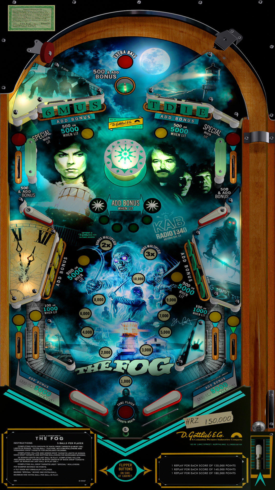

# The Fog (Original 2022)

Author(s): [HiRez00](https://vpuniverse.com/profile/19941-hirez00/)  
Download Name:  1840136187_FogThe(Gottlieb1979)v2.5for10.7.vpx.zip  
VPX Version: (Version 2.5a) Fog, The (Gottlieb 1979) v2.5 for 10.7.vpx  
Download: [VPUniverse](https://vpuniverse.com/files/file/8357-fog-the-gottlieb-1979-complete-package/)

Download Name: Directb2s: 517614716_FogThe-OriginalBackglass2.5a.zip  
B2S Version: Fog, The (Gottlieb 1979) Original Backglass.directB2S  
Download: [VPUniverse](https://vpuniverse.com/files/file/8357-fog-the-gottlieb-1979-complete-package/)

Music: 1349664621_FogThe-Music.zip  
Music Folder: (fog)  
Download: [VPUniverse](https://vpuniverse.com/files/file/8357-fog-the-gottlieb-1979-complete-package/)

Tested and Fixed by:
[TechZombie]

## Status 

Minimum VPX Standalone build: 10.8.0-1983-b84441e

| Playfield | Controls | Backglass | DMD | ROM Required | FPS | 
|-----------|----------|-----------|-----|--------------|-----|
| :white_check_mark: | :white_check_mark: | :white_check_mark: | :x: | :x: | 52 |

## Instructions

- Install this table through the Table Manager, using the `Add Table` > `Manual` page
- If you need help, more information found on the wiki: [TM - Add Table - Manual](https://github.com/LegendsUnchained/vpx-standalone-alp4k/wiki/%5B04%5D-%F0%9F%A7%A1-TM-%E2%80%90-Other-Features#add-table---manual)
- If the table requires any additional files/steps, click `GO TO TABLE` after adding, and the TM will open to the relevant table folder.
- Unzip (Music) Folder. Open folder (1349664621_FogThe-Music) place (fog) folder in vpx-thefog/music
- Stevie Wayne - "To the ships at sea who can hear my voice, look across the water, into the darkness. Look for the fog."

