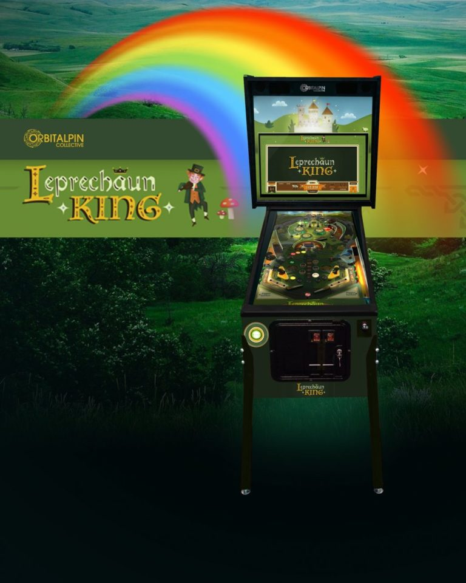

# The Leprechaun King

Author: [ScottyWic](https://orbitalpin.com/)  

Tested by: Bla1ze 

Version: 35  

Download: [Orbital Pin](https://orbitalpin.com/downloads/)

## Status 

Minimum VPX Standalone build: 10.8.0-1983-a764013
| Playfield | Controls | Backglass | DMD | ROM Required | FPS | 
|-----------|----------|-----------|-----|--------------|-----|
| :white_check_mark: | :white_check_mark: | :white_check_mark: | :white_check_mark: | :x: | 40 |

---

 

<table>
  <tr>
    <td style="background-color: #FFDDDD; padding: 0; border-left: 4px solid #FF0000;">
      

        <strong>⚠️ WARNING ⚠️</strong>
      

      

        Manually added puppacks are not supported by the VPXS 4KP team 
		We will not be able to help you diagnose issues until this puppack is in the Wizard 
		You can however find a guide here on the wiki to help you install it yourself: <a href="https://github.com/LegendsUnchained/vpx-standalone-alp4k/wiki/%5B08%5D-%E2%9D%A4%EF%B8%8F-Pup-Pack-%E2%80%90-Manual-Install">❤️ Pup Pack ‐ Manual Install</a>
      

    </td>
  </tr>
</table>

## Instructions

- In order for Pup Pack to work, create pupvideos folder and place extracted "leprechaun" folder inside
- A leprechaun's luck can be yours if you're brave enough to try 🍀
