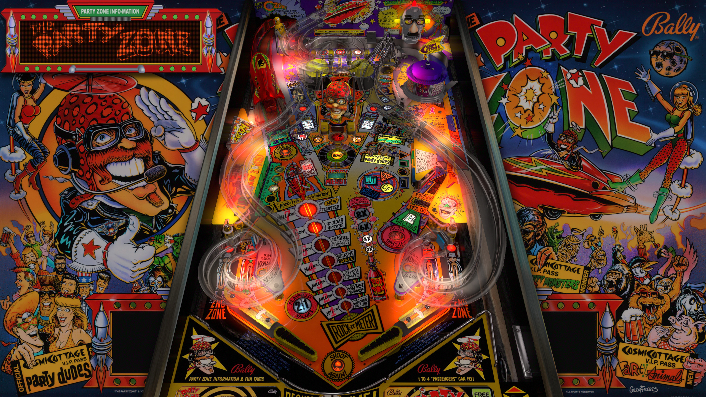

# The Party Zone (Bally 1991)
Tested by: kaoticBPR

Authors: [JPSalas](https://www.vpforums.org/index.php?showuser=277)  
Version: 4.0.0  
Download: [vpforums](https://www.vpforums.org/index.php?app=downloads&showfile=13460#)

DirectB2S

Authors: [wildman](https://vpuniverse.com/profile/5-wildman/)  
Version: 3.0  
Download: [VP Universe](https://vpuniverse.com/files/file/2147-the-party-zone-bally-1991/#google_vignette)  
- *Download the 2 screen version*

ROM

Download: [vpforums](https://www.vpforums.org/index.php?app=downloads&showfile=1196)  
Rom Name: pz_f4.zip

## Status 

Minimum VPX Standalone build: 10.8.0-1989-a764013

| Playfield | Controls | Backglass | DMD | ROM Required | FPS | 
|-----------|----------|-----------|-----|--------------|-----|
| :white_check_mark: | :white_check_mark: | :white_check_mark: | :white_check_mark: | :white_check_mark: | 45 |

## Instructions

