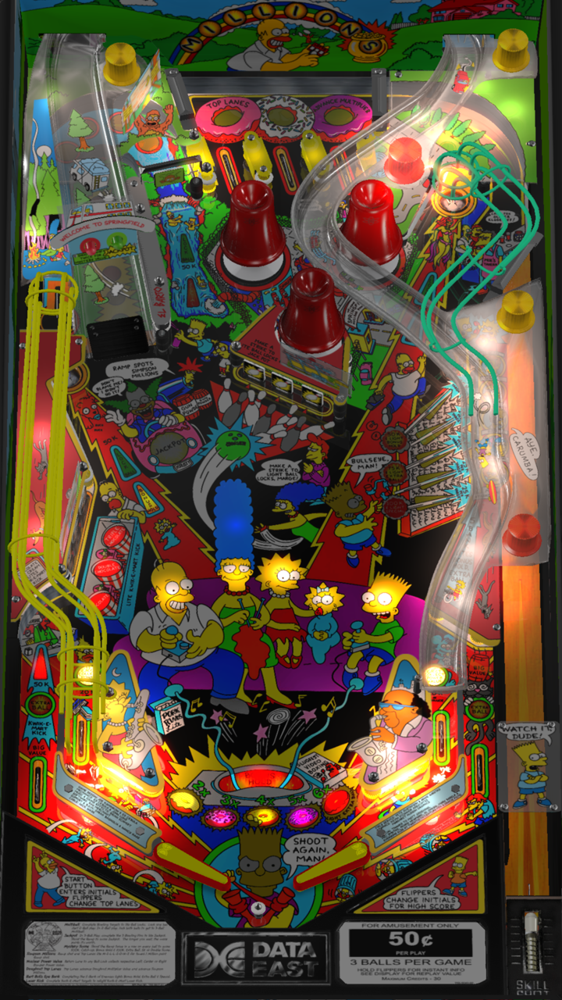

# The Simpsons (Data East 1990) 

---

## Files
| File Type | Link | Version | Author | 
|-----------|--------|----------|--------------|
| **VPX** | [VP Universe](https://vpuniverse.com/files/file/11621-the-simpsons-data-east-1990-drakkon-mod-11/)  | Simpsons Pinball Party (Stern 2003)3.2.vpx.zip | [drakkon](https://vpuniverse.com/profile/51568-drakkon/) |
| **B2S & DMD** | [VP Universe](https://vpuniverse.com/files/file/11958-the-simpsons-data-east-1990-b2s-with-full-dmd/) | 1.0.0 | [Hauntfreaks](https://vpuniverse.com/profile/5216-hauntfreaks/) |
| **ROM** | [VP Forums](https://www.vpforums.org/index.php?app=downloads&showfile=824) | **SHA:** 063595dac40b8571eb5dd9893cead54127e67b87   **MD5:** def1ad913e3c933b2282a8c64c84a739 | [destruk](https://www.vpforums.org/index.php?showuser=5) |

**Tested by:** Mar3nBu

---

## Status 

Minimum VPX Standalone build: 10.8.0-1983-a764013
| Playfield | Controls | Backglass | DMD | ROM Required | FPS | 
|-----------|----------|-----------|-----|--------------|-----|
| :white_check_mark: | :white_check_mark: | :white_check_mark: | :white_check_mark: | :white_check_mark: | 35 |

---

## Instructions

- Make sure to use the Table Manager to install this table.
- Instructions can be found on the wiki [Add Table - Manual](https://github.com/LegendsUnchained/vpx-standalone-alp4k/wiki/%5B04%5D-%F0%9F%A7%A1-TM-%E2%80%90-Other-Features#add-table---manual)
- If the table requires any additional files/steps, click `GO TO TABLE` after adding, and the TM will open to the relevant table folder.
> Don't have a cow, man. 🐄

