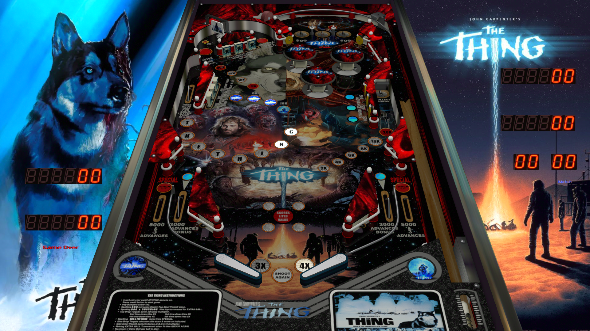

# The Thing (Balutito Reskin)

Author(s): [balutito](https://vpuniverse.com/profile/36070-balutito/)  
Version: The Thing Balutito MOD.rar  Version 1.0.0
Download:  [VPUniverse](https://vpuniverse.com/files/file/10139-the-thing-balutito-reskin/)

DirectB2S

Version: The Thing Balutito MOD.directb2s file included in table zip. 

Medias:
Medias Pack The Thing.rar

ROM: ali.zip
Ali - ROM

Author(s): [destruk](https://www.vpforums.org/index.php?showuser=5)
Download:  [VP Forums](https://www.vpforums.org/index.php?app=downloads&showfile=741)

Tested by:
[TechZombie]

## Status 

Minimum VPX Standalone build: 10.8.0-1983-b84441e
| Playfield | Controls | Backglass | DMD | ROM Required | FPS | 
|-----------|----------|-----------|-----|--------------|-----|
| :white_check_mark: | :white_check_mark: | :white_check_mark: | :white_check_mark: | :white_check_mark: | 57 |

## Instructions

- Copy the contents of this repo folder to your USB drive
- Add your personalized launcher.elf and rename it to vpx-thething.elf
- Rom file (ali.zip) stays in zip folder, place zip file in vpx-thething/pinmame/roms
- Download the table and directb2s versions listed above unzip them and copy them into vpx-thething
- Download the Medias Pack The Thing.rar and unzip it.
- Open the Music file and copy both (.mp3) files into the music file on your USB drive.
- Go fire up your Vpin turn down the lights and get ready for a new vision in terror!
- "Somebody in this camp ain't what he appears to be. Right now that may be one or two of us. By Spring, it could be all of us." ---MacReady 