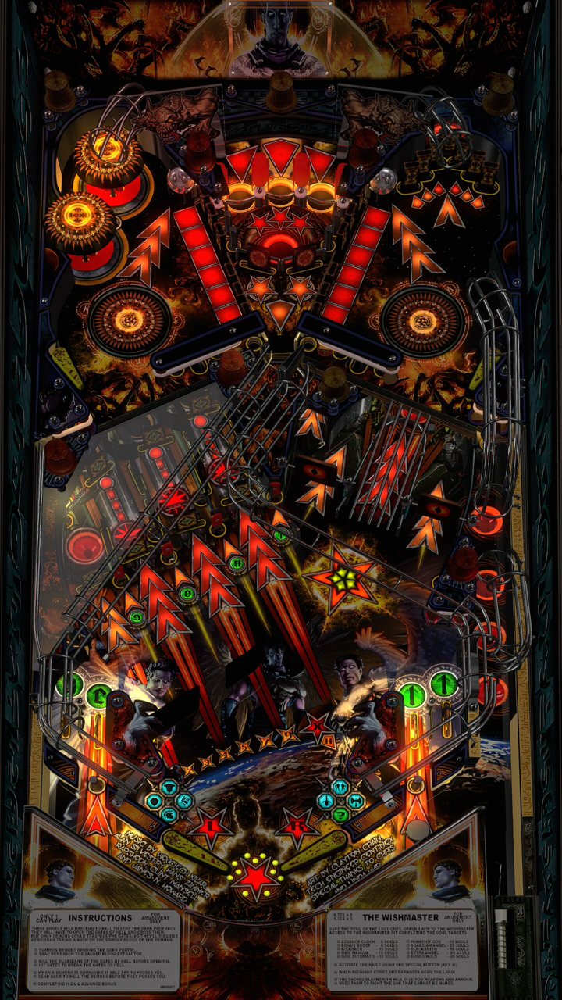

# Three Angels (Original 2018)

---

## Files
| File Type | Link | Version | Author | 
|-----------|--------|----------|--------------|
| **VPX** | [VPUniverse](https://vpuniverse.com/files/file/24248-three-angels-4k/) | 2.0 | [LoadedWeapon](https://vpuniverse.com/profile/493-loadedweapon/) | 
| **B2S** | [VPUniverse](https://vpuniverse.com/files/file/12067-three-angels-original-2018-b2s-with-full-dmd/) | 1.0.0 |[hauntfreaks](https://vpuniverse.com/profile/5216-hauntfreaks/) |
| **DMD** | - | - | - |
| **ROM** | - | - | - |

**Tested by:** [Bla1ze]

---

## Status 
**Minimum VPX Standalone build:** 10.8.0-1983-b84441e

| Playfield | Controls | Backglass | DMD | ROM Required | FPS | 
|-----------|----------|-----------|-----|--------------|-----|
| :white_check_mark: | :white_check_mark: | :white_check_mark: | :white_check_mark: | :x: | 40 |

---

## Instructions

- Make sure to use the Table Manager to install this table.
- Instructions can be found on the wiki [Add Table - Manual](https://github.com/LegendsUnchained/vpx-standalone-alp4k/wiki/%5B04%5D-%F0%9F%A7%A1-TM-%E2%80%90-Other-Features#add-table---manual)
- If the table requires any additional files/steps, click `GO TO TABLE` after adding, and the TM will open to the relevant table folder.
- When table is added, be sure to create a Music folder in vpx-threeangels and upload the 3angels folder from the table download to it.

