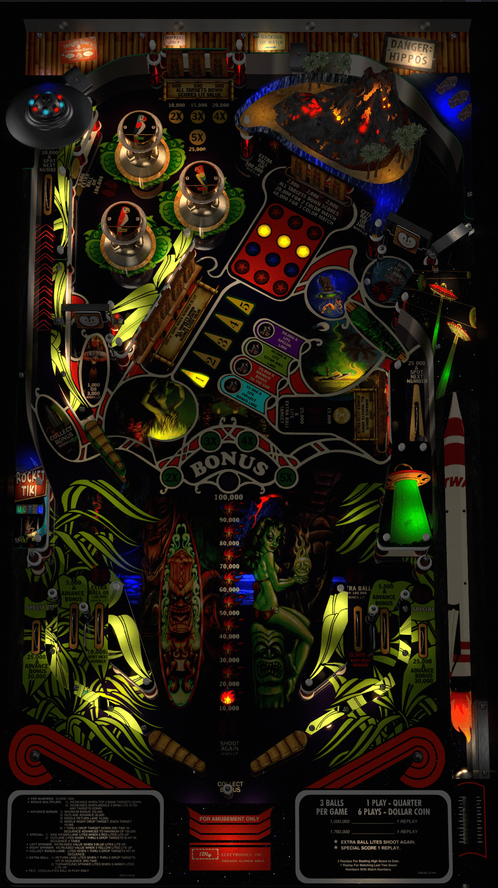

# Tiki Bob's Atomic Beach Party (Original 2021)

Authors: [iDigStuff](https://vpuniverse.com/profile/29753-idigstuff/)  
Version: 1.1  
Download: [VPUniverse](https://vpuniverse.com/files/file/7143-tiki-bobs-atomic-beach-party-original-theme-2021/)

DirectB2S

Authors: [iDigStuff](https://vpuniverse.com/profile/29753-idigstuff/)  
Version: 1.1  
Download: Included with table download!

Custom Music

Download: [MEGA](https://mega.nz/folder/5Bp2TIpQ#RyB2iGHyGuOxHuxUh3iEgQ)

ROM

Download: [VP Universe](https://vpuniverse.com/files/file/1661-cheetahzip/)  
ROM Name and version: cheetah.zip

## Status 

Minimum VPX Standalone build: 10.8.0-1989-a764013

| Playfield | Controls | Backglass | DMD | ROM Required | FPS | 
|-----------|----------|-----------|-----|--------------|-----|
| :white_check_mark: | :white_check_mark: | :white_check_mark: | :x: | :white_check_mark: | 46 |

## Instructions

- Install this table through the Table Manager, using the `Add Table` > `Manual` page
- If you need help, more infomation found on the wiki: [TM - Add Table - Manual](https://github.com/LegendsUnchained/vpx-standalone-alp4k/wiki/%5B04%5D-%F0%9F%A7%A1-TM-%E2%80%90-Other-Features#add-table---manual)
- If the table requires any additional files/steps, click `GO TO TABLE` after adding, and the TM will open to the relevant table folder.
- Place downloaded music in the external/vpx-tikibob/Music/Tiki folder
- "Enjoy the beautiful beaches and fun at the atomic beach party"

