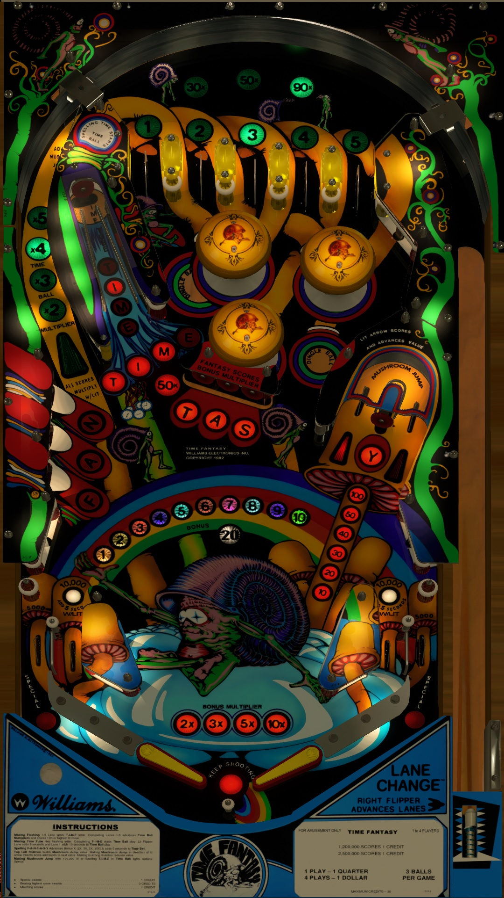

# Time Fantasy (Williams 1983)
Tested By: kaoticBPR

VRRoom1.0.jpg.cf527fbdb32dd5cb748279eb5f1e0d15.jpg)

Authors: [goldchicco](https://vpuniverse.com/profile/23579-goldchicco/)
Version: 1.0.0
Download: [VPUniverse](https://vpuniverse.com/files/file/13274-time-fantasy-williams-1983/)

DirectB2S

Authors: [arestis](https://vpuniverse.com/profile/2974-arestis/)
Version: 1.0.0
Download: [VPUniverse](https://vpuniverse.com/files/file/13327-time-fantasy-3-screen-authenticdirectb2s/)

ROM

Download: [vpforums](http://www.vpforums.org/index.php?app=downloads&showfile=233)
ROM Name and version: tmfnt_l5

## Status 

Minimum VPX Standalone build: 10.8.0-1989-a764013
| Playfield | Controls | Backglass | DMD | ROM Required | FPS | 
|-----------|----------|-----------|-----|--------------|-----|
| :white_check_mark: | :white_check_mark: | :white_check_mark: | :white_check_mark: | :white_check_mark: | 42 |

## Instructions

- Copy the contents of this repo folder to your USB drive
- Add your personalized launcher.elf and rename it to vpx-timefantasy.elf
- Download the table and directb2s versions listed above and copy them into this folder
- Make sure the vpx, direct2b, and ini files are all named the "exact" same
- Place tmfnt_l5.zip in the external/vpx-timefantasy/pinmame/roms folder *Do Not unzip*
- "The Snail looks creepy as hell!"

