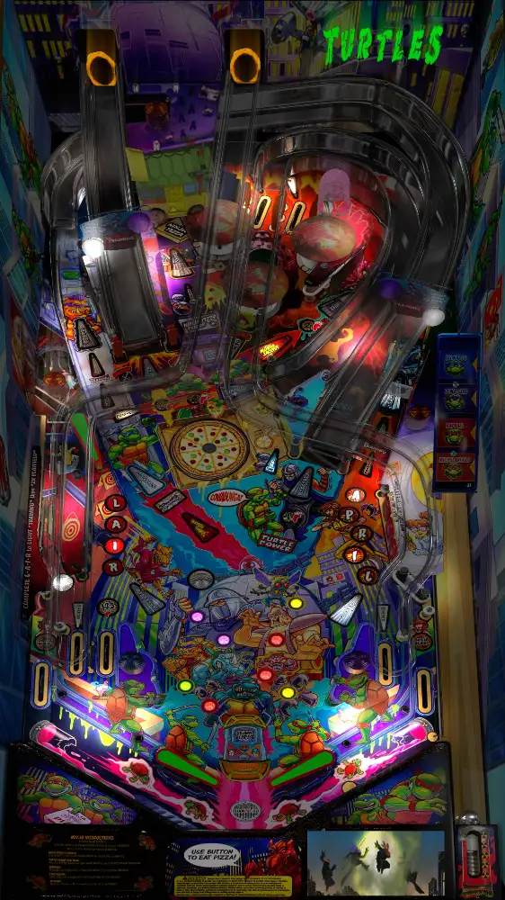

# T.M.N.T. - Remix (Original 2024)

---

## Files
| File Type | Link | Version | Author | 
|-----------|--------|----------|--------------|
| **VPX** | [VPU](https://vpuniverse.com/files/file/22296-teenage-mutant-ninja-turtles-stern-data-east-remix-v20-table/?tab=reviews) | v2.86 | [cheese3075](https://vpuniverse.com/profile/73114-cheese3075/) |
| **B2S** | [VPU](https://vpuniverse.com/files/file/21828-teenage-mutant-ninja-turtles-data-east-1991-alt-b2s-full-dmd/) | SternLE | [HauntFreaks](https://vpuniverse.com/profile/5216-hauntfreaks/) |
| **ROM** | [VPF](https://vpforums.org/index.php?app=downloads&showfile=827) | tmnt_104 | [destruk](https://vpfoums.org/index.php?s=3dc593d82108ca5a23f00ca86d4f86e0&showuser=5) |

**Tested by:** fAthAwg

---

## Status
| Playfield | Controls | Backglass | DMD | ROM Required | FPS | 
|-----------|----------|-----------|-----|--------------|-----|
| :white_check_mark: | :white_check_mark: | :white_check_mark: | :white_check_mark: | :white_check_mark: | 50 |

---

## Instructions

**Optional**
- If you want a green dmd, run the table one time, back out and open table manager, on your device navigate to the vpx-tmntle/pinmame/ini folder and open the tmnt_104.ini file. Change red to 127, green to 255 and blue to 0. Save and exit.
- "Wise man say: Forgveness is divine, but never pay full price for late pizza."
