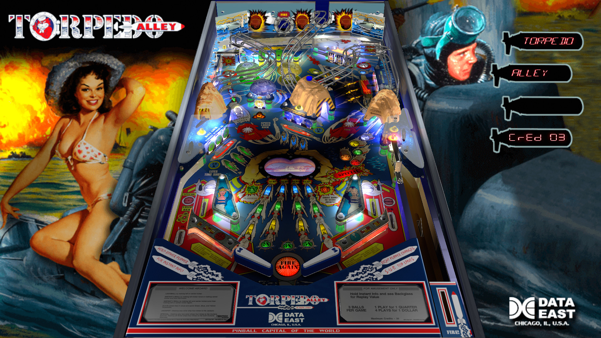

# Torpedo Alley (Data East 1988)
Tested By: kaoticBPR

Authors: [jipeji16](https://www.vpforums.org/index.php?showuser=18140)
Version: 2.2
Download: [VPForums](https://www.vpforums.org/index.php?app=downloads&showfile=15764)

DirectB2S

Authors: [wildman](https://vpuniverse.com/profile/5-wildman/)
Version: 2.0
Download: [VPUniverse](https://vpuniverse.com/files/file/3633-torpedo-alley-data-east-1988/)

ROM

Download: [vpforums](http://www.vpforums.org/index.php?app=downloads&showfile=816)
ROM Name and version: torp_e21

## Status 

Minimum VPX Standalone build: 10.8.0-1989-a764013
| Playfield | Controls | Backglass | DMD | ROM Required | FPS | 
|-----------|----------|-----------|-----|--------------|-----|
| :white_check_mark: | :white_check_mark: | :white_check_mark: | :white_check_mark: | :white_check_mark: | 32 |

## Instructions

- Install this table through the Table Manager, using the `Add Table` > `Manual` page
- If you need help, more infomation found on the wiki: [TM - Add Table - Manual](https://github.com/LegendsUnchained/vpx-standalone-alp4k/wiki/%5B04%5D-%F0%9F%A7%A1-TM-%E2%80%90-Other-Features#add-table---manual)
- If the table requires any additional files/steps, click `GO TO TABLE` after adding, and the TM will open to the relevant table folder.
- "Fire torpedos!"

