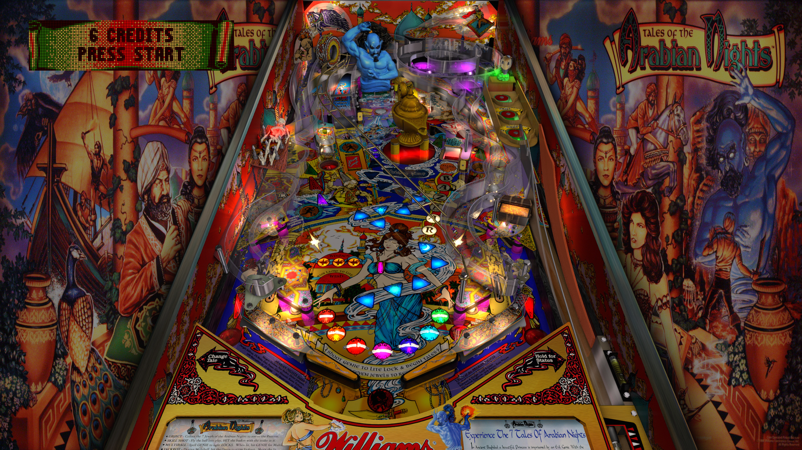

# JP's Tales of the Arabian Nights (Williams 1996)

---

## Files
| File Type | Link | Version | Author | 
|-----------|--------|----------|--------------|
| **VPX** | [VP Forums](https://www.vpforums.org/index.php?app=downloads&showfile=11611) | 5.5.0 | [jpsalas](https://www.vpforums.org/index.php?s=543a5ca562cc33a89debe8ace8834f1e&showuser=277)   |
| **B2S & DMD** | [VP Universe](https://vpuniverse.com/files/file/12134-tales-of-the-arabian-nights-williams-1996-b2s-full-dmd/) | 2.0 | [hauntfreaks](https://vpuniverse.com/profile/5216-hauntfreaks/) |
| **ROM** | [VP Forums](https://www.vpforums.org/index.php?app=downloads&showfile=1273) |  |  |

**Tested by:** 

---

## Status 

Minimum VPX Standalone build: 10.8.0-1989-a764013
| Playfield | Controls | Backglass | DMD | ROM Required | FPS | 
|-----------|----------|-----------|-----|--------------|-----|
| :white_check_mark: | :white_check_mark: | :white_check_mark: | :white_check_mark: | :white_check_mark: | 48 |

---

## Instructions

- Copy the contents of this repo folder to your USB drive
- Add your personalized launcher.elf and rename it to `vpx-totan.elf`
- Download the table and directb2s versions listed above and copy them into this folder
- Make sure (`.vpx`), (`.directb2s`), (`.ini`) and (`.vbs`) files are all named the same
- Place ROM zip file into `vpx-totan/pinmame/roms` folder. Do not unzip!
