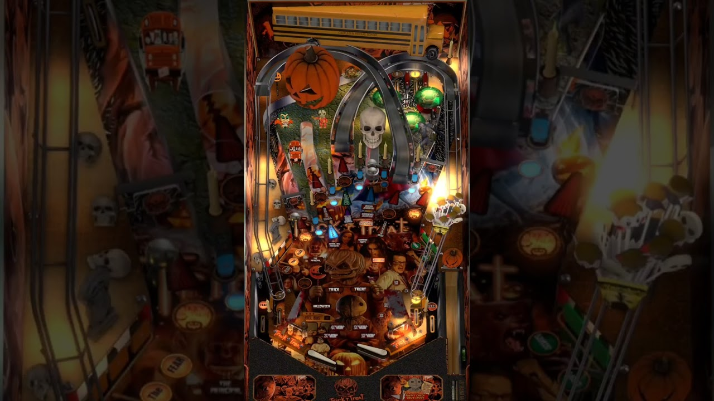

# Trick 'r Treat (Original 2023)

Tested by: Mox

## Information 
| File Type | Link | Version | Author(s) | 
|:---------:|:----:|:-------:|:---------:|
| VPX | [Mega](https://mega.nz/file/fsxVRaoD#5Oc7N0oRxNhkDOTl-kTlx_ByvdJUkMSjp83SYZLwPcg) | N/A | [JPSalas](https://www.vpforums.org/index.php?showuser=277) |
| DirectB2S | [VP Universe](https://vpuniverse.com/files/file/16456-trick-r-treat-3-screen-b2s/) | 1.0.0 | [jwkramer61](https://vpuniverse.com/profile/46356-jwkramer61/) |
| ROM | `N/A` | `N/A` | `N/A` |

## Status 
Minimum VPX Standalone build: 10.8.0-2006-6d603fb
| Playfield | Controls | Backglass | DMD | ROM Required | FPS | 
|:---------:|:--------:|:---------:|:---:|:------------:|:---:|
| :white_check_mark: | :white_check_mark: | :white_check_mark: | :white_check_mark: | :x: | 60 |

## Instructions 
- Copy the **vpx-trickrtreat** folder to the `external` directory of your USB drive
- Add your personalized launcher.elf and rename it to **vpx-trickrtreat**
- Download and extract the **VPX** and **DIRECTB2S** files ONLY, and copy them into the **vpx-trickrtreat** folder
- Make sure (.vpx), (.directb2s), and (.ini) files are all named the same. Do NOT rename the VPReg.ini file
- "Poison, Drowning, Claw, Or Knife. So Many Ways To Take A Life"

