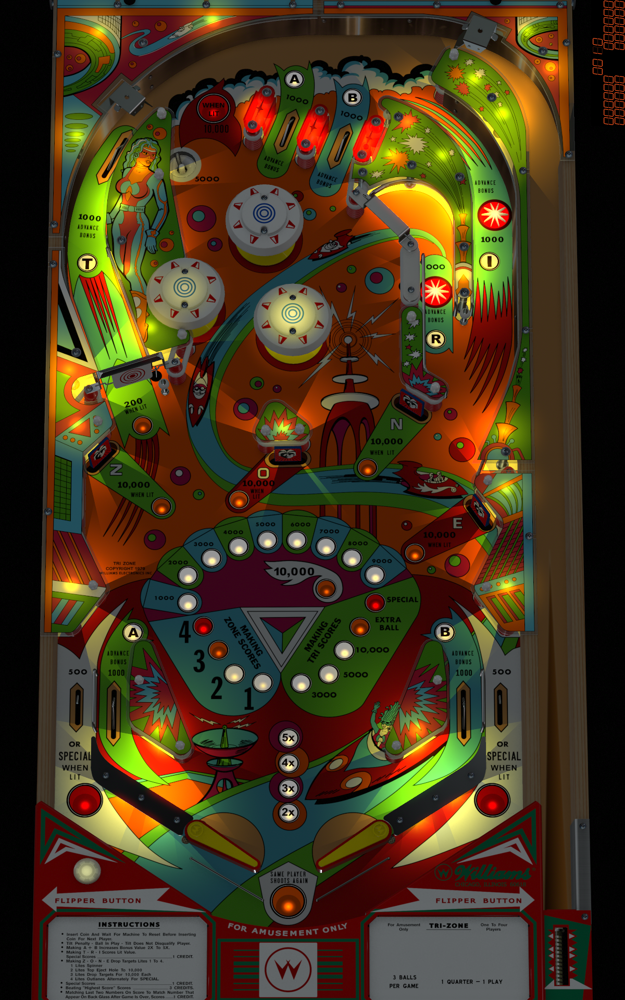

# Tri Zone (Williams 1979)

Authors: [kiwi](https://www.vpforums.org/index.php?showuser=30913)  
Version: 1.2  
Download: [VPForums](https://www.vpforums.org/index.php?app=downloads&showfile=12758)  

Note: Either version of the table will work. The one marked STG has playfield graphics from a test table.

DirectB2S

Authors: [hauntfreaks](https://vpuniverse.com/profile/5216-hauntfreaks/)  
Download: [VPUniverse](https://vpuniverse.com/files/file/21425-tri-zone-williams-1979-b2s/)

ROM

ROM Name: trizn_l1.zip  
Download: [VPUniverse](https://vpuniverse.com/files/file/1387-trizn_l1zip/)

SHA1: 690EE40D2BB7E1036FBC62AE5754D4FD12AE3B47  
MD5:  49C455575F0CE2CCE06D208CC10187FE

Tested by: evilwraith

## Status 

Minimum VPX Standalone build: 10.8.0-1989-a764013

| Playfield | Controls | Backglass | DMD | ROM Required | FPS | 
|-----------|----------|-----------|-----|--------------|-----|
| :white_check_mark: | :white_check_mark: | :white_check_mark: | :white_check_mark: | :white_check_mark: | 51 |

## Instructions

- Copy the contents of this repo folder to your USB drive
- Add your personalized launcher.elf and rename it to vpx-trizone.elf
- Download the table and directb2s listed above, extract (if necessary) and copy to external/vpx-trizone
- Make sure (.vpx), (.directb2s), and (.ini) files are all named the same
- The ROM zip file gets copied to vpx-trizone/pinmame/roms (Do NOT unzip)
