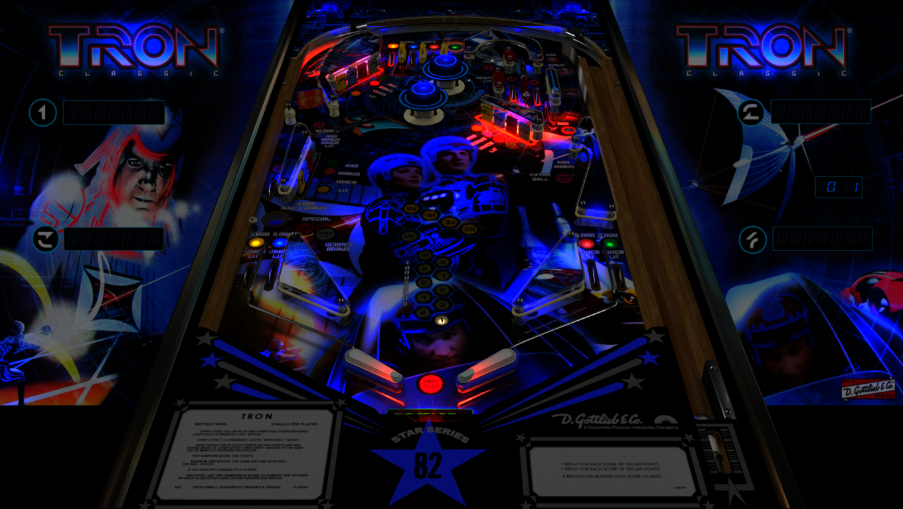

# TRON Classic (Original 2022)

Authors: [xenonph](https://vpuniverse.com/profile/8789-xenonph/)  
Version: 2.1  
Download: [VPUniverse](https://vpuniverse.com/files/file/5144-tron-classic-original-2022/)

DirectB2S

Authors: [HiRez00](https://vpuniverse.com/profile/19941-hirez00/)  
Download: [VPUniverse](https://vpuniverse.com/files/file/5143-tron-classic-original-2018-backglass/)

ROM

ROM Name: panther7.zip  
Download: [Pinball Nirvana](https://pinballnirvana.com/forums/resources/panther7.2147/)

MD5: 5bfff2b4a5b043ff621dee0b42e482a1  
SHA1: 1cf92401d9ba9806e616be6d10bdccd87ee676e3

Tested by: Parceval

## Status 

Minimum VPX Standalone build: 10.8.0-2042-1431983

| Playfield | Controls | Backglass | DMD | ROM Required | FPS | 
|-----------|----------|-----------|-----|--------------|-----|
| :white_check_mark: | :white_check_mark: | :white_check_mark: | :x: | :white_check_mark: | 45 |

## Instructions

- Copy the TRON folder into Music
- Copy panther7.nv from "match enabled vram" to vpx-tron/pinmame/nvram
- "End of Line"
