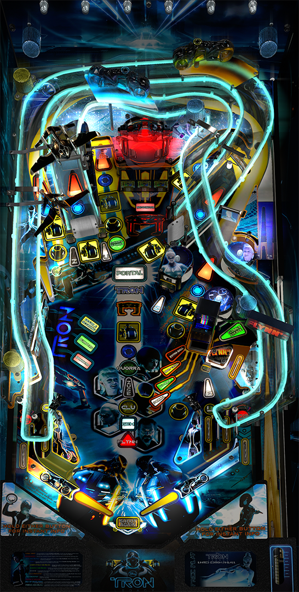

# Tron Legacy LE (Stern 2011)

Author: [Bigus1](https://www.vpforums.org/index.php?showuser=107629)  
Version: 2.1  
Download: [VP Forums](https://www.vpforums.org/index.php?app=downloads&showfile=15427)

DirectB2S

Author: [Hauntfreaks](https://vpuniverse.com/profile/5216-hauntfreaks/)  
Version: 1.0.0  
Download: [VP Universe](https://vpuniverse.com/files/file/14202-tron-legacy-le-stern-2011-b2s-2-with-full-dmd/)

ROM

Download: [VP Forums](https://vpuniverse.com/files/file/3415-tron-legacy-limited-edition-v174/)

SHA: 95593c041c0b577bd4b16f132a362cef50370d70  
MD5: ad5dc9dd5b6b5ca3430866ff8897a09b

Alt Color

Author: [PastorLUL](https://vpuniverse.com/profile/42770-pastorlul/)  
Version: 2.0.1 
Download: [VP Universe](https://vpuniverse.com/files/file/18393-tron-legacy-stern-2011-64-colors/)

Tested by: Bla1ze

## Status 

Minimum VPX Standalone build: 10.8.0-1983-a764013

| Playfield | Controls | Backglass | DMD | ROM Required | FPS | 
|-----------|----------|-----------|-----|--------------|-----|
| :white_check_mark: | :white_check_mark: | :white_check_mark: | :white_check_mark: | :white_check_mark: | 60 |

## Instructions

- Copy the contents of this repo folder to your USB drive
- Add your personalized launcher.elf and rename it to vpx-tronlegacy.elf
- Download the table and directb2s versions listed above and copy them into /external/vpx-tronlegacy
- Make sure (.vpx), (.directb2s), (.ini) and (.vbs) files are all named the same
- Place ROM zip file into vpx-tronlegacy/pinmame/roms folder. DO NOT UNZIP!
- If using the Alt Color, make "altcolor" folder in pinmame folder and place the trn_174h folder with the .cRZ file in it in the altcolor folder
- Power to the users!
