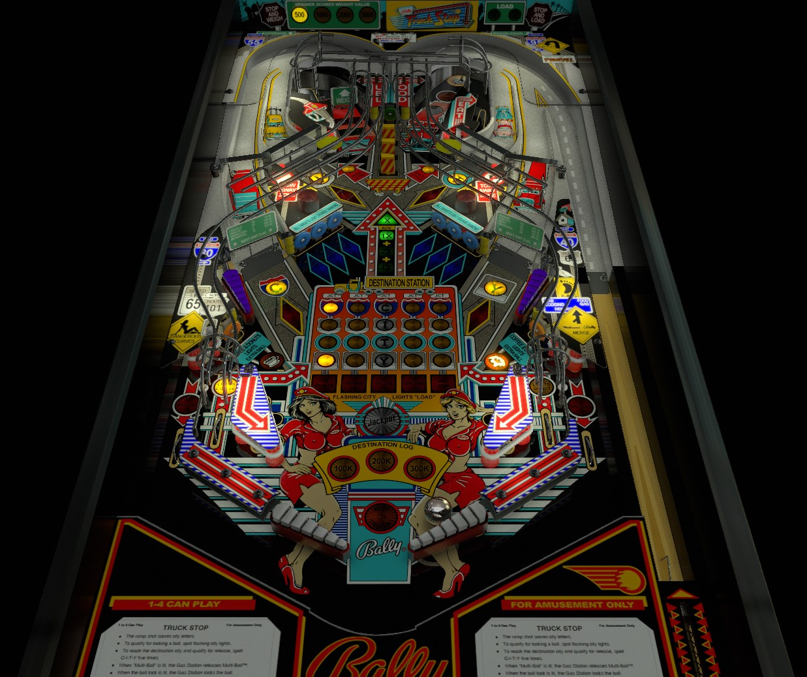

# Truck Stop (Bally 1988)
Tested by: kaoticBPR

Authors: [agenteighty6](https://vpuniverse.com/profile/25523-agenteighty6/)
Version: 2.1.0
Download: [vpforums](https://vpuniverse.com/files/file/6380-truck-stop-bally-1988/)

DirectB2S

Authors: [wildman](https://vpuniverse.com/profile/5-wildman/)
Version: 1.0.0
Download: [VP Universe](https://vpuniverse.com/files/file/2354-truck-stopbally-1988/)

ROM

Download: [vpforums](https://www.vpforums.org/index.php?app=downloads&showfile=112)
Rom Name: trucksp3.zip

## Status 

Minimum VPX Standalone build: 10.8.0-1989-a764013
| Playfield | Controls | Backglass | DMD | ROM Required | FPS | 
|-----------|----------|-----------|-----|--------------|-----|
| :white_check_mark: | :white_check_mark: | :white_check_mark: | :white_check_mark: | :white_check_mark: | 38 |

## Instructions

- Install this table through the Table Manager, using the `Add Table` > `Manual` page
- If you need help, more infomation found on the wiki: [TM - Add Table - Manual](https://github.com/LegendsUnchained/vpx-standalone-alp4k/wiki/%5B04%5D-%F0%9F%A7%A1-TM-%E2%80%90-Other-Features#add-table---manual)
- If the table requires any additional files/steps, click `GO TO TABLE` after adding, and the TM will open to the relevant table folder.

