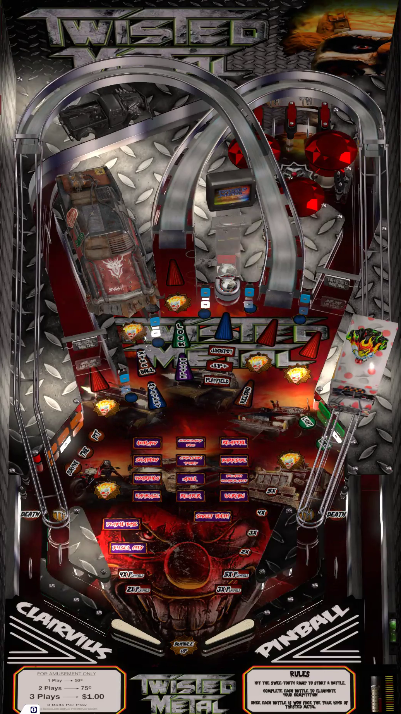

# Twisted Metal (Clairvius 2024)

Authors: [clairvius](https://vpuniverse.com/profile/16134-clairvius/)  
Version: 1.5  
Download: [VP Universe](https://vpuniverse.com/files/file/20493-twisted-metal-clairvius-2024/)

DirectB2S

Authors: [marcobus2005](https://vpuniverse.com/profile/53087-marcobus2005/)  
Version: 1.0.0  
Download: [VP Universe](https://vpuniverse.com/files/file/20656-twisted-metal-clairvius-2024-animated-b2s-with-full-dmd/)

## Status 

Minimum VPX Standalone build: 10.8.0-1989-a764013

| Playfield | Controls | Backglass | DMD | ROM Required | FPS | 
|-----------|----------|-----------|-----|--------------|-----|
| :white_check_mark: | :white_check_mark: | :white_check_mark: | :white_check_mark: | :x: | 60 |

## Instructions

- Copy the contents of this repo folder to your USB drive
- Add your personalized launcher.elf and rename it to vpx-twistedmetal.elf
- Download the table and directb2s versions listed above, extract (if necessary) and copy them into vpx-twistedmetal
- CALYPSO, WHAT HAVE YOU DONE? WHAT HAVE YOU DONE?!!
