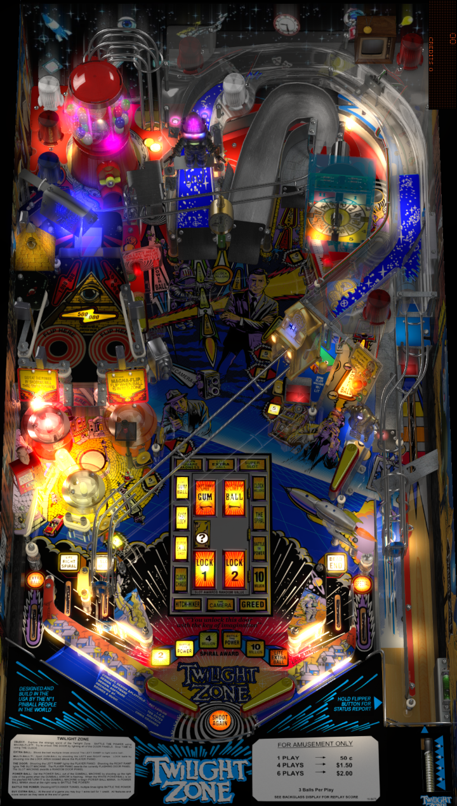

# Twilight Zone (Bally 1993)

Authors: [ninuzzu](https://vpuniverse.com/profile/5530-ninuzzu/)
Version: 2.1
Download: [VP Universe](https://vpuniverse.com/files/file/5500-twilight-zone-bally-1993/)

DirectB2S

Authors: [hauntfreaks](https://vpuniverse.com/profile/5216-hauntfreaks/)
Version: 2.0
Download: [VP Universe](https://vpuniverse.com/files/file/12147-twilight-zone-bally-1993-b2s-full-dmd/)

ROM - Download both

Download: [VP Forums](https://www.vpforums.org/index.php?app=downloads&showfile=1237)
Download: [VP Forums](https://www.vpforums.org/index.php?app=downloads&showfile=1236)

## Status 

Minimum VPX Standalone build: 10.8.0-1989-a764013
| Playfield | Controls | Backglass | DMD | ROM Required | FPS | 
|-----------|----------|-----------|-----|--------------|-----|
| :white_check_mark: | :white_check_mark: | :white_check_mark: | :white_check_mark: | :white_check_mark: | 42 |

## Instructions

- Install this table through the Table Manager, using the `Add Table` > `Manual` page
- If you need help, more infomation found on the wiki: [TM - Add Table - Manual](https://github.com/LegendsUnchained/vpx-standalone-alp4k/wiki/%5B04%5D-%F0%9F%A7%A1-TM-%E2%80%90-Other-Features#add-table---manual)
- If the table requires any additional files/steps, click `GO TO TABLE` after adding, and the TM will open to the relevant table folder.
- Place BOTH rom zip files into vpx-tz/pinmame/roms folder. DO NOT UNZIP THEM!
- "You're traveling through another dimension..."

