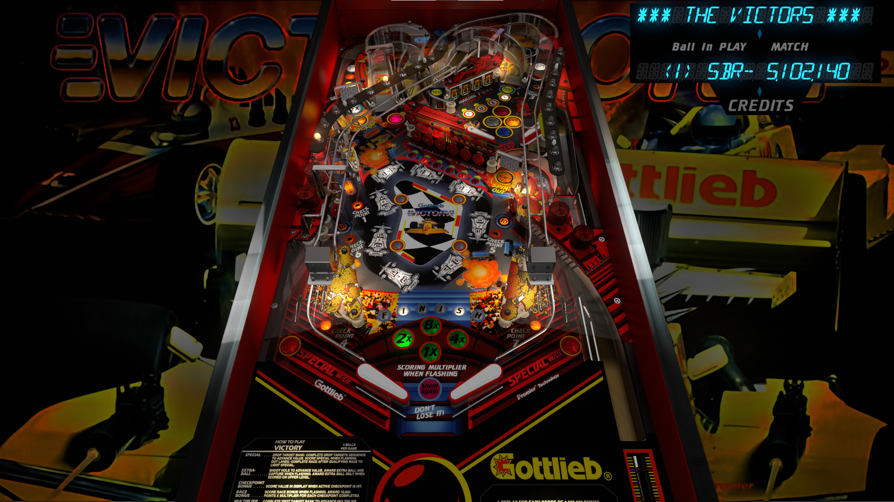

# Victory (Gottlieb 1987)

---

## Files
| File Type | Link | Version | Author | 
|-----------|--------|----------|--------------|
| **VPX** | [VP Forums](https://www.vpforums.org/index.php?app=downloads&showfile=15232) | 2.0 | [bigus1](https://www.vpforums.org/index.php?showuser=107629) |
| **B2S** | [VPUniverse](https://vpuniverse.com/files/file/4547-victory-premier-1987/) | 1.0 | [Wildman](https://vpuniverse.com/profile/5-wildman/) |
| **DMD** | N/A | N/A | N/A |
| **ROM** | [Pinball Nirvana](https://pinballnirvana.com/forums/resources/victory.2562/) | N/A | N/A |

**Tested by:** [mcap10], [mrandromeda]

---

## Status 
**Minimum VPX Standalone build:** 10.8.0-5b941e6

| Table | Playfield | Controls | Backglass | DMD | ROM Required | Has Puppack | FPS |
|-----------|----------|-----------|-----|--------------|-----|-----|-----|
| :white_check_mark: | :white_check_mark: | :white_check_mark: | :white_check_mark: | :white_check_mark: | :white_check_mark: | :x: | 55 |

---

## Instructions

- Install this table through the Table Manager, using the `Add Table` > `Manual` page
- If you need help, more infomation found on the wiki: [TM - Add Table - Manual](https://github.com/LegendsUnchained/vpx-standalone-alp4k/wiki/%5B04%5D-%F0%9F%A7%A1-TM-%E2%80%90-Other-Features#add-table---manual)
- For B2S download `Victory_(Premier_1987)2scr.rar`

