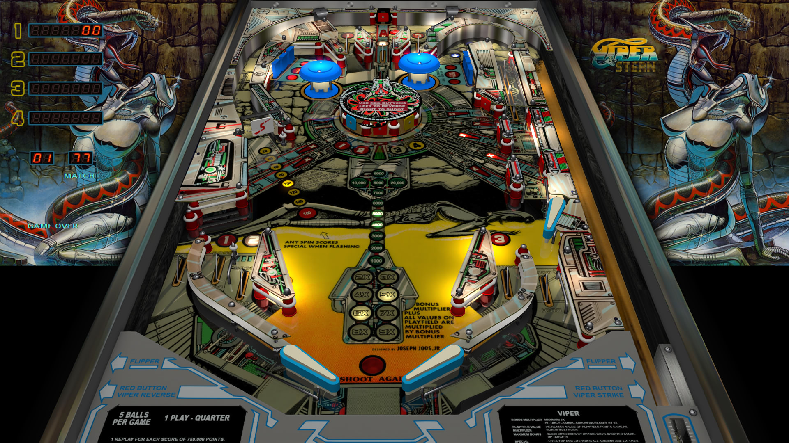

# Viper (Stern 1981)

---

## Files
| File Type | Link | Version | Author | 
|-----------|--------|----------|--------------|
| **VPX** | [vpforums](https://www.vpforums.org/index.php?app=downloads&showfile=13289) | 5.5.0 | [JPSalas](https://www.vpforums.org/index.php?showuser=277) |
| **B2S & DMD** | [vpforums](https://www.vpforums.org/index.php?app=downloads&showfile=11052) | 1.0 | [kramer73](https://www.vpforums.org/index.php?showuser=309) |
| **ROM** | [vpforums](http://www.vpforums.org/index.php?app=downloads&showfile=753) | viper.zip |  |

**Tested by: shavendave** 

---

## Status 

Minimum VPX Standalone build: 10.8.0-1989-a764013
| Playfield | Controls | Backglass | DMD | ROM Required | FPS | 
|-----------|----------|-----------|-----|--------------|-----|
| :white_check_mark: | :white_check_mark: | :white_check_mark: | :white_check_mark: | :white_check_mark: | 50 |

---

## Instructions

- Make sure to use the Table Manager to install this table.
- Instructions can be found on the wiki [Add Table - Manual](https://github.com/LegendsUnchained/vpx-standalone-alp4k/wiki/%5B04%5D-%F0%9F%A7%A1-TM-%E2%80%90-Other-Features#add-table---manual)
- If the table requires any additional files/steps, click `GO TO TABLE` after adding, and the TM will open to the relevant table folder.
>"Feed the Viper Cannon, destroy your targets"

