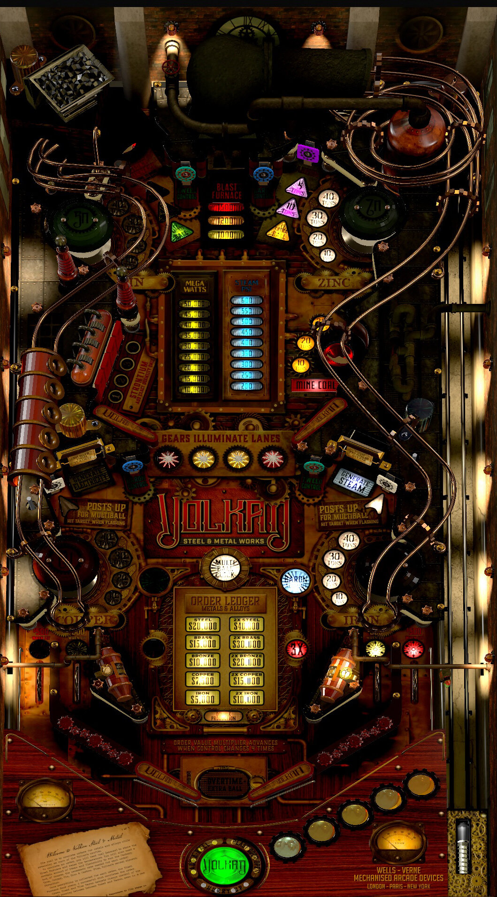

# Volkan Metal and Steel (Original 2023)

TABLE

Author: [OneVox](https://vpuniverse.com/profile/14340-onevox/)  
Table Version: 1.3  
Download File: Volkan Steel and Metal (Original 2023)v1.3.vpx.zip  
VPX Version: Volkan Steel and Metal (Original 2023)v1.3.vpx  
Download: [VP Universe](https://vpuniverse.com/files/file/14978-volkan-steel-and-metal-original-2023/)

BACKGLASS/DIRECTB2S

Author: [tartzani](https://vpuniverse.com/profile/36680-tartzani/)  
Directb2s Version: 1.0.0  
Directb2s File: Volkan Steel and Metal (Original 2023) B2S.zip  
Directb2s: Volkan Steel and Metal (Original 2023).directb2s  
Download: [VP Universe](https://vpuniverse.com/files/file/14978-volkan-steel-and-metal-original-2023/)

## Status 

Minimum VPX Standalone build: 10.8.0-1983-b84441e  

| Playfield | Controls | Backglass | DMD | ROM Required | FPS | 
|-----------|----------|-----------|-----|--------------|-----|
| :white_check_mark: | :white_check_mark: | :white_check_mark: | :x: | :x: | 60 |

## Instructions

- Install this table through the Table Manager, using the `Add Table` > `Manual` page
- If you need help, more information found on the wiki: [TM - Add Table - Manual](https://github.com/LegendsUnchained/vpx-standalone-alp4k/wiki/%5B04%5D-%F0%9F%A7%A1-TM-%E2%80%90-Other-Features#add-table---manual)
- If the table requires any additional files/steps, click `GO TO TABLE` after adding, and the TM will open to the relevant table folder.

