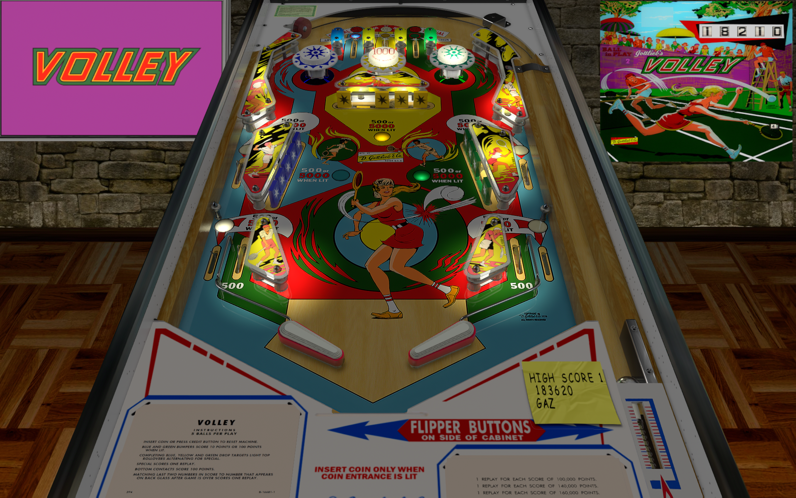

# Volley (Gottlieb 1976)

## Files
| File Type | Link | Version | Author | 
|-----------|--------|----------|--------------|
| **VPX** | [VPForums](https://www.vpforums.org/index.php?app=downloads&showfile=17350) | 1.0 | [bigus1](https://www.vpforums.org/index.php?showuser=107629) |
| **B2S** | [VPUniverse](https://vpuniverse.com/files/file/15987-volley-gottlieb-1976/) | 1.0.0 | [Wildman](https://vpuniverse.com/profile/5-wildman/) |
| **DMD** | Not Needed | Not Needed | Not Needed |
| **ROM** | Not Needed | Not Needed | Not Needed |

**Tested by:** [vicpac73]

---

## Status 
**Minimum VPX Standalone build:** {vpx-standalone-build-#}
| Playfield | Controls | Backglass | DMD | ROM Required | FPS | 
|-----------|----------|-----------|-----|--------------|-----|
| :white_check_mark: | :white_check_mark: | :white_check_mark: | :x: | :x: | 55 |

---

## Instructions

- Install this table through the Table Manager, using the `Add Table` > `Manual` page
- If you need help, more information found on the wiki: [TM - Add Table - Manual](https://github.com/LegendsUnchained/vpx-standalone-alp4k/wiki/%5B04%5D-%F0%9F%A7%A1-TM-%E2%80%90-Other-Features#add-table---manual)
- If the table requires any additional files/steps, click `GO TO TABLE` after adding, and the TM will open to the relevant table folder.

