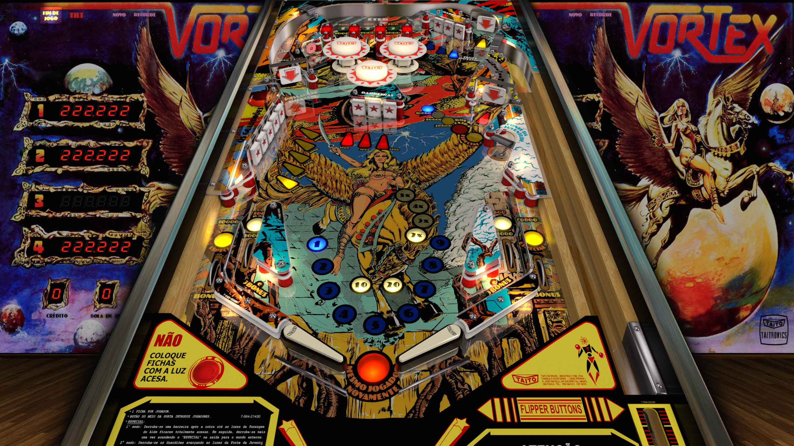

# Vortex (Taito do Brasil 1981)

Authors: [JPSalas](https://www.vpforums.org/index.php?showuser=277)  
Version: 5.5.0  
Download: [VP Forums](https://www.vpforums.org/index.php?app=downloads&showfile=13336)

DirectB2S

Authors [Wildman](https://vpuniverse.com/profile/5-wildman/)  
Version: 2.5  
Download: [VP Universe](https://vpuniverse.com/files/file/2466-vortex-taito-1983/)

ROM

Authors: [destruk](https://www.vpforums.org/index.php?showuser=5)  
Download: [VP Forums](https://www.vpforums.org/index.php?app=downloads&showfile=567)  
MD5:3b524272cc39b51fb516cbc8dc2139cf

Tested by: Boris

## Status 

Minimum VPX Standalone build: 10.8.0-1989-a764013

| Playfield | Controls | Backglass | DMD | ROM Required | FPS | 
|-----------|----------|-----------|-----|--------------|-----|
| :white_check_mark: | :white_check_mark: | :white_check_mark: | :x: | :white_check_mark: | 60 |

## Instructions

- Copy the contents of this repo folder to your USB drive
- Add your personalized launcher.elf and rename it to vpx-vortex.elf
- Download the table and directb2s versions listed above, extract (if necessary) and copy them to external/vpx-vortex
- Download the ROM listed above and copy it to vpx-vortex/pinmame/roms. Do not unzip! 
- Make sure (.vpx), (.directb2s), (.vbs), and (.ini) files are all named the same
- Cue 'Ride of the Valkyries'
