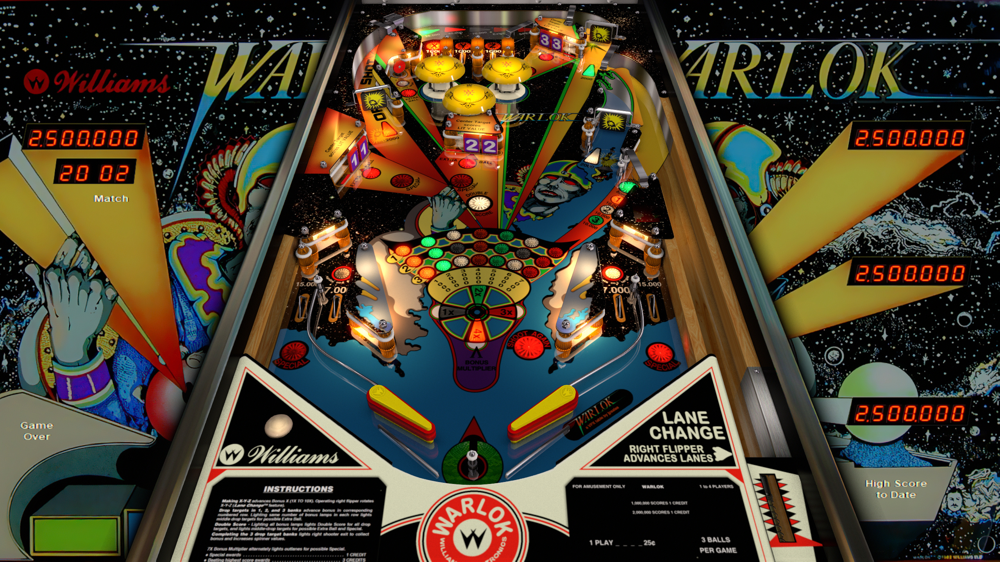

# Warlok (Williams 1982)

Authors: [JPSalas](https://www.vpforums.org/index.php?showuser=277)
Version: 4.0.0
Download: [vpforums](https://www.vpforums.org/index.php?app=downloads&showfile=14371)

DirectB2S

Authors: [wildman](https://vpuniverse.com/profile/5-wildman/)
Version: 2.0
Download: [vpuniverse](https://vpuniverse.com/files/file/2847-warlok-williams-1982/)

ROM

Download: [vpforums](http://www.vpforums.org/index.php?app=downloads&showfile=804)
ROM Name and version: wrlok_l3.zip

## Status 

Minimum VPX Standalone build: 10.8.0-1989-a764013
| Playfield | Controls | Backglass | DMD | ROM Required | FPS | 
|-----------|----------|-----------|-----|--------------|-----|
| :white_check_mark: | :white_check_mark: | :white_check_mark: | :white_check_mark: | :white_check_mark: | 60 |

## Instructions

- Make sure to use the Table Manager to install this table.
- Instructions can be found on the wiki [Add Table - Manual](https://github.com/LegendsUnchained/vpx-standalone-alp4k/wiki/%5B04%5D-%F0%9F%A7%A1-TM-%E2%80%90-Other-Features#add-table---manual)
- If the table requires any additional files/steps, click `GO TO TABLE` after adding, and the TM will open to the relevant table folder.
- "He's plans to conquer the universe, can you stop him?"

