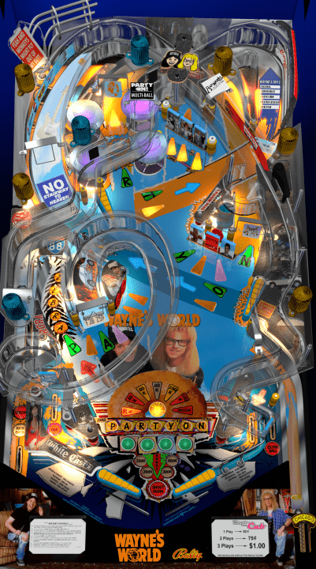

# Wayne's World (Original 2020)

Author(s): [k8951](https://vpuniverse.com/profile/28646-k8951/)  
Version: Version 1.1  
Download: Wayne's World [MOD 1.1 by Kara].zip  
VPX Version: Wayne's World1.1.vpx  
Download: [VPUniverse](https://vpuniverse.com/files/file/5997-wayne%e2%80%99s-world/)

DirectB2S included with Table Zip  
Directb2s Version: Wayne's World1.1.directb2s  
Author(s): [k8951](https://vpuniverse.com/profile/28646-k8951/) 

Radical (L-1) - ROM  
ROM: radcl_l1.zip (Custom Created ROM) (Compatible with VpinMame beta 3.6 and newer.)

MD5: 401B619EF523A046CE17EC0A62E863CE  
SHA-1: 48551C1995966CABF9F9B38D19562C093C3F01F6

Author(s): [TechZombie]  
Download: [Internet Archive](https://archive.org/details/radcl_l1)

Tested by:
[TechZombie]

## Status 

**You may have to re-start the table in order to play.**  
**This table is loud and may need some audio adjusting.**

Minimum VPX Standalone build: 10.8.0-1983-b84441e

| Playfield | Controls | Backglass | DMD | ROM Required | FPS | 
|-----------|----------|-----------|-----|--------------|-----|
| :white_check_mark: | :white_check_mark: | :white_check_mark: | :x: | :white_check_mark: | 50 |

## Instructions

- Copy the contents of this repo folder to your USB drive
- Add your personalized launcher.elf and rename it to vpx-waynesworld.elf
- Download the table zip above, extract it and copy (Wayne's World1.1.vpx) into vpx-waynesworld
- Select (Wayne's World1.1.directb2s) and copy into vpx-waynesworld
- ROM file (radcl_l1.zip) stays in zip folder, place zip file in vpx-waynesworld/pinmame/roms
- Make sure (.vpx) (.direct2b2s) and (.ini) are all named the same
- Place Music Folder into vpx-waynesworld
- "Hundreds of VPin tables on the ALP4K? On a single USB?"  "We're not worthy... we're not worthy!" ---Wayne and Garth
