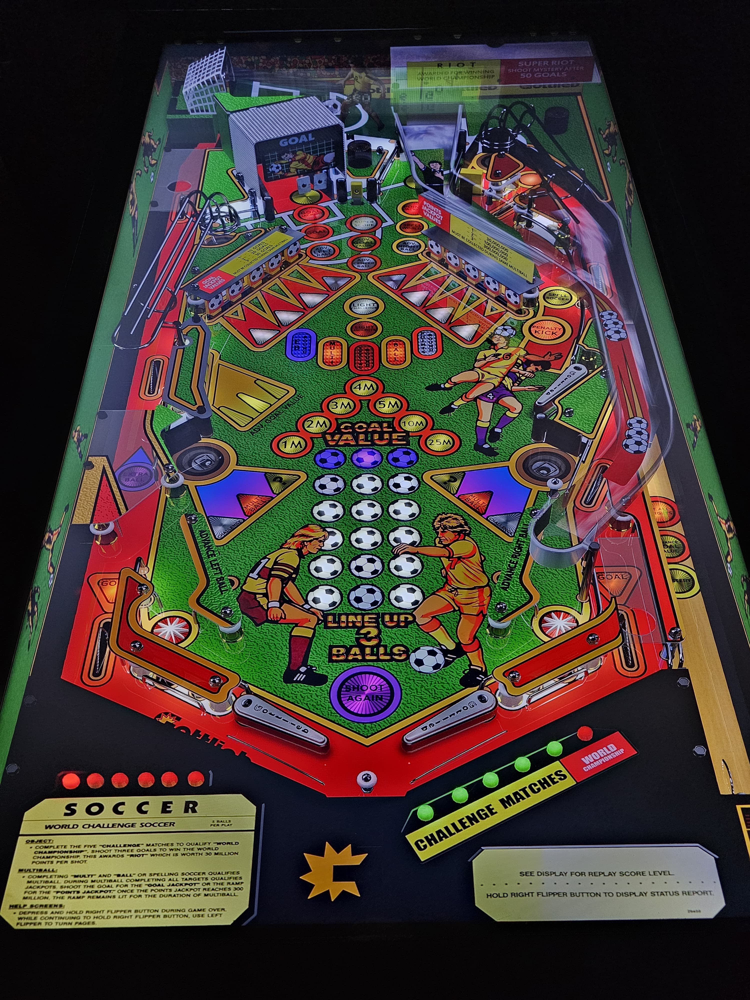

# World Challenge Soccer (Gottlieb 1994)

---

## Files
| File Type | Link | Version | Author | 
|-----------|--------|----------|--------------|
| **VPX** | [VP Universe](https://vpuniverse.com/files/file/15469-world-challenge-soccer-gottlieb-1994-dacstylemod-vrrar/) | 1.0 | [dacstyle](https://vpuniverse.com/profile/53372-dacstyle/) |
| **B2S & DMD** | [VP Universe](https://vpuniverse.com/files/file/15482-world-challenge-soccer-premier-1994-b2s-with-full-dmd/) | 1.0.1 | [hauntfreaks](https://vpuniverse.com/profile/5216-hauntfreaks/) |
| **ROM** | [Pinball Nirvana](https://pinballnirvana.com/forums/resources/wcsoccer.2583/) | World Challenge Soccer (Premier 1994) full dmd.zip | [Rock-ola](https://pinballnirvana.com/forums/members/rock-ola.1/) |

## Status 

Minimum VPX Standalone build: 10.8.0-1989-a764013

| Playfield | Controls | Backglass | DMD | ROM Required | FPS | 
|-----------|----------|-----------|-----|--------------|-----|
| :white_check_mark: | :white_check_mark: | :white_check_mark: | :white_check_mark: | :white_check_mark: | 50 |

---

## Instructions

