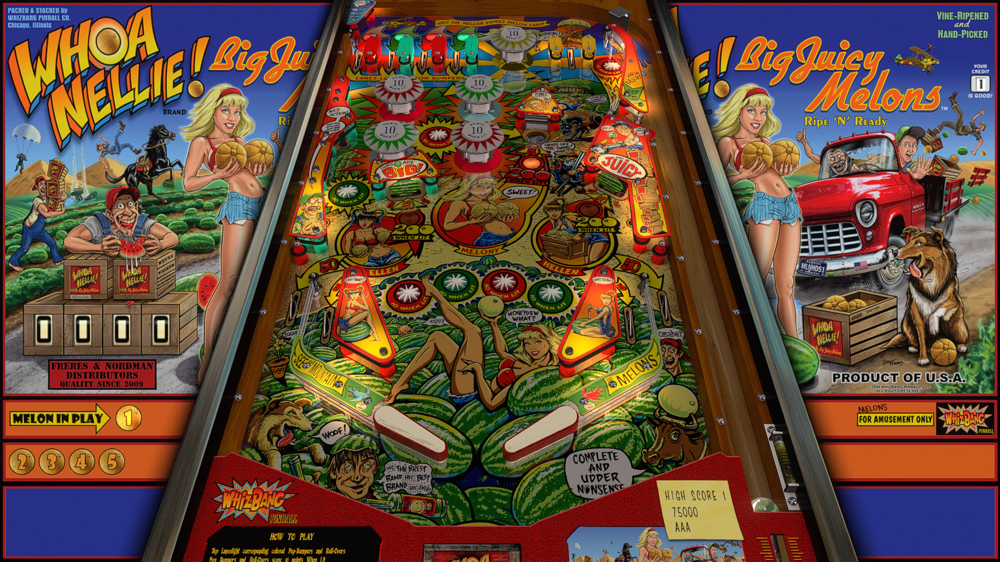

# Whoa Nellie! (Original 2022)

Authors: [jpsalas](https://www.vpforums.org/index.php?showuser=277)  
Version: 5.5.0  
Download: [VP Forums](https://www.vpforums.org/index.php?app=downloads&showfile=16889)

DirectB2S

Authors: [hauntfreaks](https://www.vpforums.org/index.php?showuser=73849)  
Version: 4.1.0 / JP's Whoa Nellie! v41.directb2s.zip  
Download: [VP Forums](https://www.vpforums.org/index.php?app=downloads&showfile=16889)

## Status 

Minimum VPX Standalone build: 10.8.0-1989-a764013

| Playfield | Controls | Backglass | DMD | ROM Required | FPS | 
|-----------|----------|-----------|-----|--------------|-----|
| :white_check_mark: | :white_check_mark: | :white_check_mark: | :white_check_mark: | :x: | 60 |

## Instructions

- Copy the contents of this repo folder to your USB drive
- Add your personalized launcher.elf and rename it to vpx-whoanellie.elf
- Download the table and directb2s versions listed above, extract (if necessary) and copy them to external/vpx-woahnellie
- Make sure (.vpx), (.directb2s), and (.ini) files are all named the same
