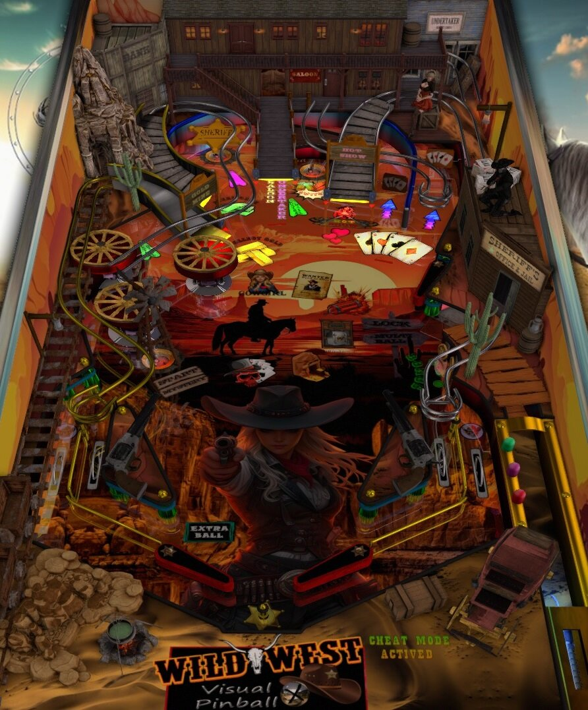

# Wild West (Original 2024)

Authors: [Tombg](https://vpuniverse.com/profile/61082-tombg/)  
Version: (1.0.0) WildWest.zip  
Filename:WildWest.vpx  
Download: [VP Universe](https://vpuniverse.com/files/file/21855-wild-west/)

DirectB2S

Authors: [Tombg](https://vpuniverse.com/profile/61082-tombg/)  
Version: (1.0.0) b2s.zip  
Filename: WILDWEST-3 Screens.directb2s  
Download: [VP Universe](https://vpuniverse.com/files/file/21855-wild-west/)

No ROM Needed

Tested by: TechZombie

## Status 

Minimum VPX Standalone build: 10.8.0-1989-a764013

| Playfield | Controls | Backglass | DMD | ROM Required | FPS | 
|-----------|----------|-----------|-----|--------------|-----|
| :white_check_mark: | :white_check_mark: | :white_check_mark: | :white_check_mark: | :x: | 55 |

## Instructions

- Install this table through the Table Manager, using the `Add Table` > `Manual` page
- If you need help, more infomation found on the wiki: [TM - Add Table - Manual](https://github.com/LegendsUnchained/vpx-standalone-alp4k/wiki/%5B04%5D-%F0%9F%A7%A1-TM-%E2%80%90-Other-Features#add-table---manual)
- If the table requires any additional files/steps, click `GO TO TABLE` after adding, and the TM will open to the relevant table folder.
- "Yee-Haw"

