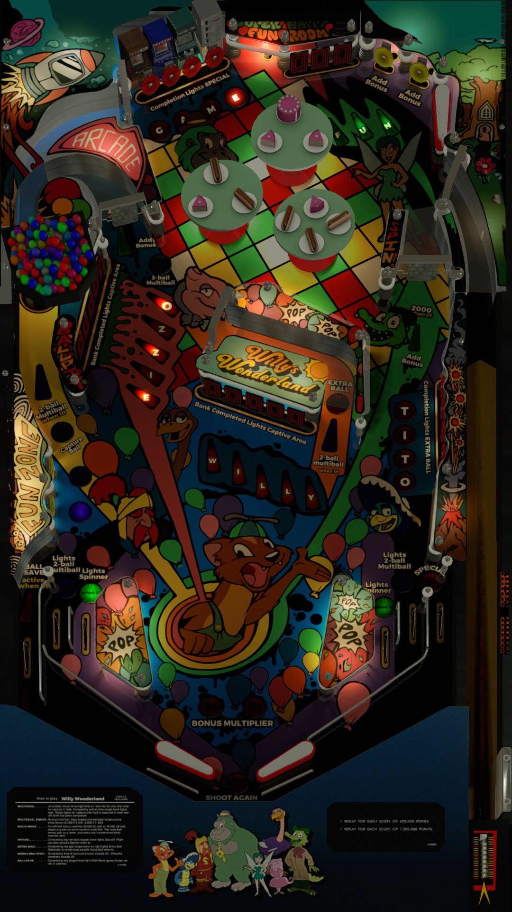

# Willy's Wonderland (Original 2021)

---

## Files
| File Type | Link | Version | Author | 
|-----------|--------|----------|--------------|
| **VPX** | [vpforums](https://www.vpforums.org/index.php?app=downloads&showfile=15620) | v2.0 | [goldchicco](https://www.vpforums.org/index.php?showuser=88795) |
| **B2S** | [vpforums](https://www.vpforums.org/index.php?app=downloads&showfile=15620) | v2.0 | [goldchicco](https://www.vpforums.org/index.php?showuser=88795) |
| **ROM** | [pinballnirvana](https://pinballnirvana.com/forums/resources/dvlsdre.1744/) | 9-9-2022 | [Rock-ola](https://pinballnirvana.com/forums/members/rock-ola.1/) |

**Tested by:** [Silentkat] & [OminousOsie]

---

## Status 

| Playfield | Controls | Backglass | DMD | ROM Required | FPS | 
|-----------|----------|-----------|-----|--------------|-----|
| :white_check_mark: | :white_check_mark: | :white_check_mark: | :white_check_mark: | :white_check_mark: | 45 |

---

## Instructions

- Place `Willy` folder in `vpx-willyswonderland/music`
- Don't forget to take regular breaks!
